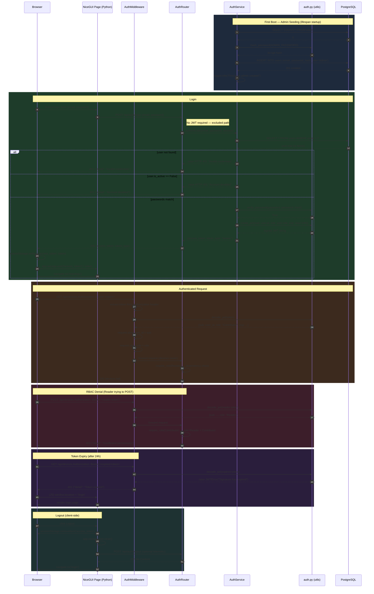

# Auth Flow — Sequence Diagram

```mermaid
sequenceDiagram
    autonumber
    participant Browser
    participant NiceGUI as NiceGUI Page (Python)
    participant Middleware as AuthMiddleware
    participant Router as AuthRouter
    participant Service as AuthService
    participant Utils as auth.py (utils)
    participant DB as PostgreSQL

    %% ─── FIRST BOOT ──────────────────────────────────────────
    rect rgb(30, 42, 60)
        Note over Service,DB: First Boot — Admin Seeding (lifespan startup)
        Service->>DB: SELECT COUNT(*) FROM users
        DB-->>Service: 0
        Service->>Utils: hash_password(ADMIN_PASSWORD)
        Utils-->>Service: bcrypt hash
        Service->>DB: INSERT INTO users (email, password_hash, role='Admin')
        DB-->>Service: 201 created
        Service->>Service: logger.info("First-boot admin created")
    end

    %% ─── LOGIN ───────────────────────────────────────────────
    rect rgb(30, 60, 42)
        Note over Browser,DB: Login
        Browser->>NiceGUI: Submit login form {email, password}
        NiceGUI->>Router: POST /api/auth/login {email, password}
        Note right of Router: No JWT required — excluded path
        Router->>Service: authenticate(email, password, session)
        Service->>DB: SELECT * FROM users WHERE email = ?
        DB-->>Service: user row (or None)
        alt user not found
            Service-->>Router: raise HTTP 401 "Invalid credentials"
            Router-->>Browser: 401 {"detail": "Invalid credentials"}
        else user.is_active == False
            Service-->>Router: raise HTTP 401 "Account disabled"
            Router-->>Browser: 401 {"detail": "Account disabled"}
        else passwords match
            Service->>Utils: verify_password(password, password_hash)
            Utils-->>Service: True
            Service->>Utils: create_jwt({sub: user.id, role: user.role, exp: now+24h})
            Utils-->>Service: signed JWT string
            Service-->>Router: {access_token, token_type: "bearer"}
            Router-->>Browser: 200 {access_token, token_type}
            Browser->>Browser: sessionStorage.setItem('access_token', token)
            Browser->>NiceGUI: app.storage.user['access_token'] = token
            NiceGUI->>Browser: navigate.to('/topology')
        end
    end

    %% ─── AUTHENTICATED REQUEST ───────────────────────────────
    rect rgb(60, 42, 30)
        Note over Browser,DB: Authenticated Request
        Browser->>Middleware: GET /api/devices  Authorization: Bearer <token>
        Middleware->>Middleware: extract token from Authorization header
        Middleware->>Utils: decode_jwt(token)
        Utils-->>Middleware: {sub: user_id, role: "Contributor", exp: ...}
        Middleware->>Middleware: request.state.user_id = sub
        Middleware->>Middleware: request.state.role = role
        Middleware->>Router: forward request (devices router)
        Router->>Router: require_role(Reader) ← dependency check
        Router-->>Browser: 200 [devices list]
    end

    %% ─── RBAC DENIAL ─────────────────────────────────────────
    rect rgb(60, 30, 42)
        Note over Browser,Router: RBAC Denial (Reader trying to POST)
        Browser->>Middleware: POST /api/devices  Authorization: Bearer <reader-token>
        Middleware->>Utils: decode_jwt(reader-token)
        Utils-->>Middleware: {sub: ..., role: "Reader"}
        Middleware->>Router: forward request
        Router->>Router: require_role(Contributor) ← role=Reader < Contributor
        Router-->>Browser: 403 {"detail": "Insufficient permissions"}
    end

    %% ─── TOKEN EXPIRY ────────────────────────────────────────
    rect rgb(42, 30, 60)
        Note over Browser,Middleware: Token Expiry (after 24h)
        Browser->>Middleware: GET /api/devices  Authorization: Bearer <expired-token>
        Middleware->>Utils: decode_jwt(expired-token)
        Utils-->>Middleware: raise JWTError("Signature has expired")
        Middleware-->>Browser: 401 {"detail": "Token expired"}
        Browser->>NiceGUI: (JS) window.location = '/login'
        NiceGUI->>Browser: render login page
    end

    %% ─── LOGOUT ──────────────────────────────────────────────
    rect rgb(30, 50, 50)
        Note over Browser,NiceGUI: Logout (client-side)
        Browser->>NiceGUI: click Logout
        NiceGUI->>Browser: sessionStorage.removeItem('access_token')
        NiceGUI->>NiceGUI: app.storage.user.clear()
        NiceGUI->>Router: POST /api/auth/logout  (optional telemetry)
        Router-->>NiceGUI: 204 No Content
        NiceGUI->>Browser: navigate.to('/login')
    end
```
