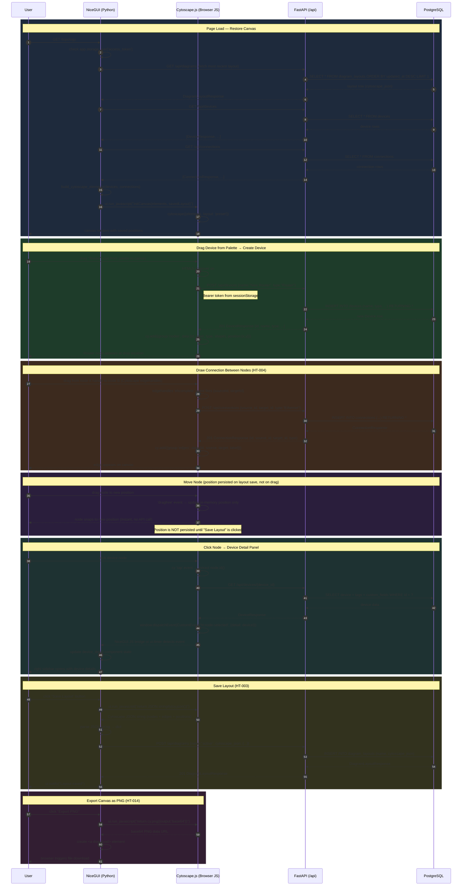

# Canvas Interaction — Sequence Diagram

```mermaid
sequenceDiagram
    autonumber
    participant User
    participant NiceGUI as NiceGUI (Python)
    participant JS as Cytoscape.js (Browser JS)
    participant API as FastAPI (/api)
    participant DB as PostgreSQL

    %% ─── PAGE LOAD ───────────────────────────────────────────
    rect rgb(30, 42, 60)
        Note over User,DB: Page Load — Restore Canvas
        User->>NiceGUI: GET /topology
        NiceGUI->>NiceGUI: check app.storage.user['access_token']
        NiceGUI->>API: GET /api/diagrams  (fetch most recent layout)
        API->>DB: SELECT * FROM diagram_layouts ORDER BY updated_at DESC LIMIT 1
        DB-->>API: layout row (cytoscape_json)
        API-->>NiceGUI: DiagramLayoutResponse
        NiceGUI->>API: GET /api/devices
        API->>DB: SELECT * FROM devices
        DB-->>API: device rows
        API-->>NiceGUI: [DeviceResponse, ...]
        NiceGUI->>API: GET /api/connections
        API->>DB: SELECT * FROM connections
        DB-->>API: connection rows
        API-->>NiceGUI: [ConnectionResponse, ...]
        NiceGUI->>NiceGUI: build_cytoscape_elements(devices, connections)
        NiceGUI->>JS: ui.run_javascript("initCanvas(elements, savedLayout)")
        JS->>JS: cytoscape({elements, layout: 'preset'})
        JS-->>User: canvas renders with saved positions
    end

    %% ─── DRAG DEVICE FROM PALETTE ───────────────────────────
    rect rgb(30, 60, 42)
        Note over User,DB: Drag Device from Palette → Create Device
        User->>JS: drag "Router" icon from palette to canvas
        JS->>JS: HTML5 dragover on #cy → calculate canvas coords {x, y}
        JS->>API: POST /api/devices  {name:"New Router", type:"Router"}
        Note right of JS: Bearer token from sessionStorage
        API->>DB: INSERT INTO devices (name, type, ...) RETURNING *
        DB-->>API: new Device row
        API-->>JS: 201 DeviceResponse {id, name, type, ...}
        JS->>JS: cy.add({group:'nodes', data:{id, label, type, shape}, position:{x,y}})
        JS-->>User: Router node appears at drop location
    end

    %% ─── DRAW CONNECTION ─────────────────────────────────────
    rect rgb(60, 42, 30)
        Note over User,DB: Draw Connection Between Nodes (HT-004)
        User->>JS: drag from node A handle to node B (Cytoscape edgehandles)
        JS->>JS: edgehandles 'ehcomplete' event fires {sourceId, targetId}
        JS->>API: POST /api/connections  {source_id, target_id, type:"Ethernet"}
        API->>DB: INSERT INTO connections (...) RETURNING *
        DB-->>API: ConnectionResponse
        API-->>JS: 201 ConnectionResponse {id, source_id, target_id, type}
        JS->>JS: cy.add({group:'edges', data:{id, source, target, label}})
        JS-->>User: edge appears on canvas
    end

    %% ─── MOVE NODE ───────────────────────────────────────────
    rect rgb(42, 30, 60)
        Note over User,DB: Move Node (position persisted on layout save, not on drag)
        User->>JS: drag node to new position
        JS->>JS: 'dragfree' event → update in-memory position only
        JS-->>User: node snaps to new position (instant, no API call)
        Note over JS: Position is NOT persisted until "Save Layout" is clicked
    end

    %% ─── CLICK NODE → DETAIL PANEL ──────────────────────────
    rect rgb(30, 50, 50)
        Note over User,DB: Click Node → Device Detail Panel
        User->>JS: click device node
        JS->>JS: cy 'tap' event → extract node.id()
        JS->>API: GET /api/devices/{device_id}
        API->>DB: SELECT device + tags + custom_fields WHERE id = ?
        DB-->>API: device data
        API-->>JS: DeviceResponse
        JS->>JS: window.dispatchEvent(CustomEvent('ht:node-selected', {detail: device}))
        JS-->>NiceGUI: NiceGUI JS bridge or ui.timer detects event
        NiceGUI->>NiceGUI: update device_detail component state
        NiceGUI-->>User: right sidebar opens with device details
    end

    %% ─── SAVE LAYOUT ─────────────────────────────────────────
    rect rgb(50, 50, 30)
        Note over User,DB: Save Layout (HT-003)
        User->>NiceGUI: click "Save Layout" button
        NiceGUI->>JS: ui.run_javascript("return JSON.stringify(cy.json())")
        JS-->>NiceGUI: Cytoscape JSON string (nodes + edges + positions)
        NiceGUI->>NiceGUI: parse JSON string → dict
        NiceGUI->>API: POST /api/diagrams  {name:"active", cytoscape_json: {...}}
        API->>DB: INSERT INTO diagram_layouts (name, cytoscape_json)
        DB-->>API: DiagramLayoutResponse
        API-->>NiceGUI: 201 DiagramLayoutResponse
        NiceGUI-->>User: ui.notify("Layout saved")
    end

    %% ─── EXPORT CANVAS ───────────────────────────────────────
    rect rgb(50, 30, 50)
        Note over User,JS: Export Canvas as PNG (HT-014)
        User->>NiceGUI: click "Export PNG"
        NiceGUI->>JS: ui.run_javascript("return cy.png({output:'base64'})")
        JS-->>NiceGUI: base64 PNG data URL
        NiceGUI->>NiceGUI: create <a download> element
        NiceGUI-->>User: browser triggers file download
    end
```
