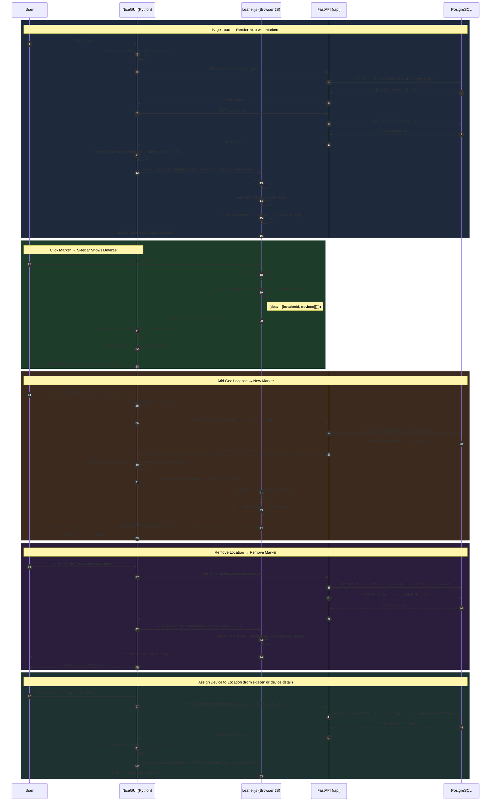

# Map Interaction — Sequence Diagram

```mermaid
sequenceDiagram
    autonumber
    participant User
    participant NiceGUI as NiceGUI (Python)
    participant JS as Leaflet.js (Browser JS)
    participant API as FastAPI (/api)
    participant DB as PostgreSQL

    %% ─── PAGE LOAD ───────────────────────────────────────────
    rect rgb(30, 42, 60)
        Note over User,DB: Page Load — Render Map with Markers
        User->>NiceGUI: GET /map
        NiceGUI->>NiceGUI: check app.storage.user['access_token']
        NiceGUI->>API: GET /api/locations?type=geo
        API->>DB: SELECT * FROM locations WHERE type = 'geo'
        DB-->>API: [LocationResponse, ...]
        API-->>NiceGUI: geo locations list
        NiceGUI->>API: GET /api/devices
        API->>DB: SELECT * FROM devices
        DB-->>API: [DeviceResponse, ...]
        API-->>NiceGUI: all devices
        NiceGUI->>NiceGUI: group devices by location_id → dict[str, list[Device]]
        NiceGUI->>JS: ui.run_javascript("initMap(locationsJson, devicesByLocationJson)")
        JS->>JS: L.map('#map').setView([20,0], 2)
        JS->>JS: add OpenStreetMap tile layer
        JS->>JS: for each location: L.marker([lat, lng]).addTo(map)
        JS-->>User: map renders with location markers
    end

    %% ─── CLICK MARKER ────────────────────────────────────────
    rect rgb(30, 60, 42)
        Note over User,NiceGUI: Click Marker → Sidebar Shows Devices
        User->>JS: click location marker
        JS->>JS: marker 'click' event fires
        JS->>JS: window.dispatchEvent(CustomEvent('ht:marker-clicked',
        Note right of JS:   {detail: {locationId, devices[]}}))
        JS-->>NiceGUI: NiceGUI JS bridge / ui.timer detects event
        NiceGUI->>NiceGUI: filter devices for locationId from in-memory cache
        NiceGUI->>NiceGUI: update sidebar component with device list
        NiceGUI-->>User: right sidebar shows devices at that location
    end

    %% ─── ADD LOCATION ────────────────────────────────────────
    rect rgb(60, 42, 30)
        Note over User,DB: Add Geo Location → New Marker
        User->>NiceGUI: fill "Add Location" form {name, lat, lng}
        NiceGUI->>NiceGUI: validate lat ∈ [-90,90], lng ∈ [-180,180]
        NiceGUI->>API: POST /api/locations {name, type:"geo", lat, lng}
        API->>DB: INSERT INTO locations (name, type, lat, lng)
        DB-->>API: LocationResponse {id, name, lat, lng, ...}
        API-->>NiceGUI: 201 LocationResponse
        NiceGUI->>NiceGUI: add new location to in-memory device_by_location cache
        NiceGUI->>JS: ui.run_javascript("addMapMarker({id, lat, lng, name})")
        JS->>JS: L.marker([lat, lng]).addTo(leafletMap)
        JS->>JS: attach click handler for new marker
        JS-->>User: new marker appears on map
        NiceGUI-->>User: ui.notify("Location added")
    end

    %% ─── REMOVE LOCATION ─────────────────────────────────────
    rect rgb(42, 30, 60)
        Note over User,DB: Remove Location → Remove Marker
        User->>NiceGUI: click "Delete" on location in sidebar
        NiceGUI->>API: DELETE /api/locations/{location_id}
        API->>DB: UPDATE devices SET location_id = NULL WHERE location_id = ?
        API->>DB: DELETE FROM locations WHERE id = ?
        DB-->>API: 204 No Content
        API-->>NiceGUI: 204
        NiceGUI->>JS: ui.run_javascript("removeMapMarker('{location_id}')")
        JS->>JS: find marker by id → leafletMap.removeLayer(marker)
        JS-->>User: marker removed from map
        NiceGUI-->>User: sidebar clears device list
    end

    %% ─── ASSIGN DEVICE TO LOCATION ───────────────────────────
    rect rgb(30, 50, 50)
        Note over User,DB: Assign Device to Location (from sidebar or device detail)
        User->>NiceGUI: select device from dropdown, click "Assign to this location"
        NiceGUI->>API: PATCH /api/devices/{device_id}  {location_id: location_id}
        API->>DB: UPDATE devices SET location_id = ?, updated_at = NOW() WHERE id = ?
        DB-->>API: DeviceResponse (updated)
        API-->>NiceGUI: 200 DeviceResponse
        NiceGUI->>NiceGUI: update in-memory devices_by_location cache
        NiceGUI->>JS: ui.run_javascript("updateMarkerPopup('{location_id}', deviceCount)")
        JS-->>User: marker popup shows updated device count
    end
```
