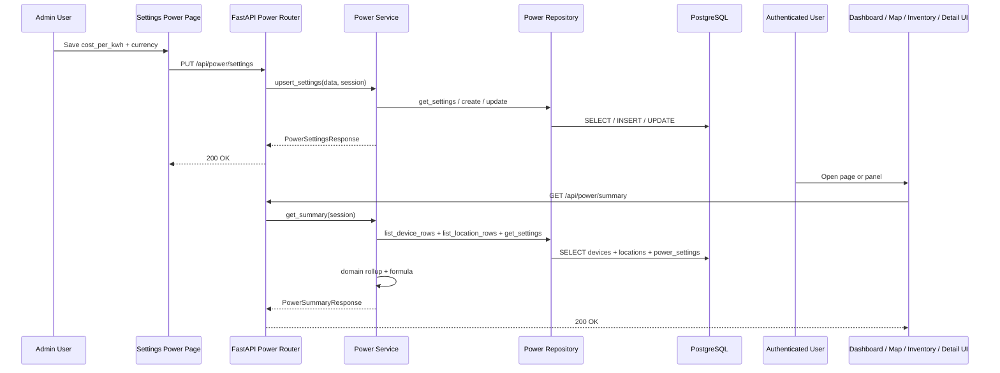
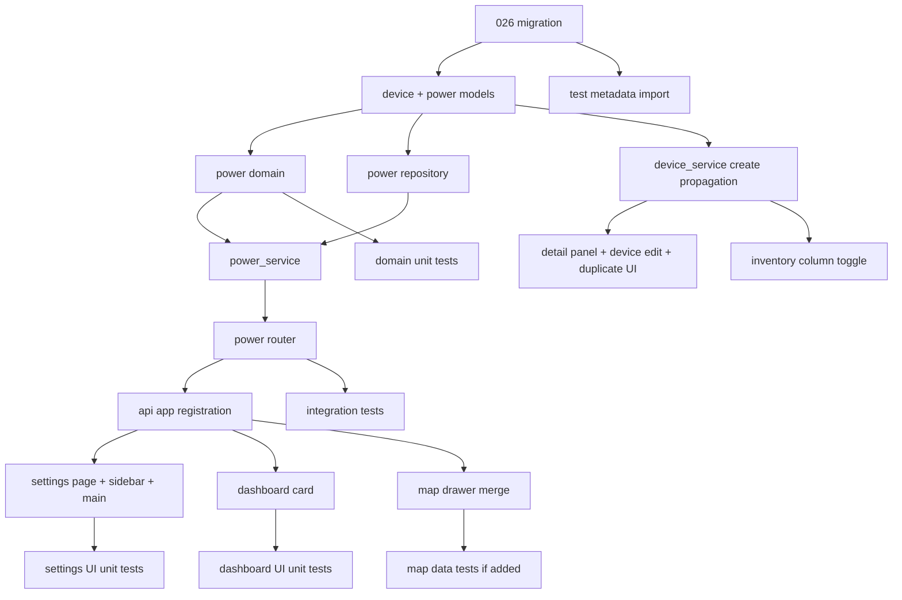

# RFC: Power Usage Tracking

**Story:** HT-044  
**Status:** Draft  
**Date:** 2026-04-17  
**Author:** Architect

---

## 1. Overview

HT-044 adds a typed per-device power field, recursive power aggregation across the location tree, and an Admin-managed electricity rate used to turn watts into monthly cost estimates.

The minimal durable design is:

- add `power_watts` directly to `Device`
- add a dedicated typed singleton table for power-cost settings
- expose one read API for summary analytics and one Admin-only settings API
- feed the existing map drawer and dashboard card from that same summary instead of creating a second location-power endpoint

This RFC intentionally rejects a generic `system_settings(key, value)` design. A key-value table would permit invalid states at rest, push parsing into services, and weaken the schema contract for something the product already knows is typed: one non-negative numeric rate and one 3-letter currency code.

The dashboard integration is **included now**, not deferred. HT-026 is already shipped in this repo via `src/ui/pages/dashboard.py`, so the story's conditional branch does not apply here.

The current user-facing "location detail" surface in this repo is the map drawer added by HT-008. HT-044 treats that drawer as the location-detail surface for power totals and does not introduce a new standalone rack-location page.

---

## 2. Visual Architecture And Flow



---

## 3. Hidden Design Decisions (Parnas Test)

| Module | Hides |
|---|---|
| `src/models/device.py` | The persisted shape of device power metadata. |
| `src/models/power_settings.py` | The typed persistence contract for global power-cost configuration. |
| `src/models/power_summary.py` | The wire-format contract for aggregate power responses. |
| `src/domain/power.py` | The monthly-cost formula, paired-settings invariant, and recursive location rollup algorithm. |
| `src/repositories/power_repository.py` | The SQL query strategy for power-related reads and singleton settings persistence. |
| `src/services/power_service.py` | The orchestration that turns repository rows into summary and settings responses. |
| `src/api/routers/power.py` | The HTTP contract and RBAC boundary for power analytics and settings writes. |
| `src/ui/pages/settings_power.py` | The Admin-only power settings workflow in NiceGUI. |
| `src/ui/pages/dashboard.py` | How dashboard power data is fetched and presented without leaking API details into other pages. |
| `src/ui/pages/map_page_data.py` | How geo locations are merged with power summary rows for the map drawer. |

---

## 4. Data Model Changes

**Alembic migration required - DevOps-Engineer migration review required.**

### 4.1 Modified file: `src/models/device.py`

Add `power_watts` to the existing schema hierarchy so create, update, response, and enriched response all stay aligned.

```python
class DeviceBase(SQLModel):
    name: str = Field(min_length=1, max_length=255)
    type: DeviceType
    status: DeviceStatus = Field(default=DeviceStatus.Active)
    ip: Optional[str] = Field(default=None, max_length=45)
    mac: Optional[str] = Field(default=None, max_length=17)
    os: Optional[str] = Field(default=None, max_length=255)
    notes: Optional[str] = Field(default=None, max_length=5000)
    power_watts: Optional[int] = Field(default=None, ge=0)
    location_id: Optional[uuid.UUID] = Field(default=None, foreign_key="locations.id")
    parent_id: Optional[uuid.UUID] = Field(default=None, foreign_key="devices.id")


class DeviceUpdate(SQLModel):
    name: Optional[str] = Field(default=None, min_length=1, max_length=255)
    type: Optional[DeviceType] = None
    status: Optional[DeviceStatus] = None
    ip: Optional[str] = Field(default=None, max_length=45)
    mac: Optional[str] = Field(default=None, max_length=17)
    os: Optional[str] = Field(default=None, max_length=255)
    notes: Optional[str] = Field(default=None, max_length=5000)
    power_watts: Optional[int] = Field(default=None, ge=0)
    location_id: Optional[uuid.UUID] = None
    parent_id: Optional[uuid.UUID] = None
    version: int
```

Why this location: `DeviceResponse` and `DeviceResponseEnriched` inherit from `DeviceBase`, so putting the field here automatically keeps every device payload in sync.

Behavioral contract:

- `null` means unknown / unset and is persisted as SQL `NULL`
- `0` is valid and counts as "device has power data"
- negative values are rejected by the model layer before the service runs
- non-numeric values are rejected by Pydantic request parsing

### 4.2 New file: `src/models/power_settings.py`

Use a dedicated typed singleton resource, not a generic key-value table.

```python
from datetime import datetime, timezone
from typing import Optional

from pydantic import field_validator
from sqlmodel import Field, SQLModel


def _utcnow() -> datetime:
    return datetime.now(timezone.utc)


class PowerSettingsBase(SQLModel):
    cost_per_kwh: Optional[float] = Field(default=None, ge=0)
    currency: Optional[str] = Field(default=None, min_length=3, max_length=3)

    @field_validator("currency")
    @classmethod
    def validate_currency(cls, value: Optional[str]) -> Optional[str]:
        if value is None:
            return None
        normalized = value.strip().upper()
        if len(normalized) != 3 or not normalized.isalpha():
            raise ValueError("currency must be a 3-letter ISO code")
        return normalized


class PowerSettings(PowerSettingsBase, table=True):
    __tablename__ = "power_settings"

    scope: str = Field(default="global", primary_key=True, max_length=16)
    updated_at: datetime = Field(default_factory=_utcnow)


class PowerSettingsCreate(PowerSettingsBase):
    pass


class PowerSettingsUpdate(SQLModel):
    cost_per_kwh: Optional[float] = Field(default=None, ge=0)
    currency: Optional[str] = Field(default=None, min_length=3, max_length=3)

    @field_validator("currency")
    @classmethod
    def validate_currency(cls, value: Optional[str]) -> Optional[str]:
        if value is None:
            return None
        normalized = value.strip().upper()
        if len(normalized) != 3 or not normalized.isalpha():
            raise ValueError("currency must be a 3-letter ISO code")
        return normalized


class PowerSettingsResponse(PowerSettingsBase):
    updated_at: datetime | None = None
```

Why `scope: "global"` instead of a UUID primary key:

- it encodes the singleton nature at the schema boundary
- it avoids "first row wins" service logic
- it keeps the implementation minimal while still typed

Why `currency` is a validated string rather than a new enum in `src/models/types.py`:

- ISO currency codes are an open set for this product
- a repo enum would create churn without adding product value
- the actual invariant is syntactic: 3 uppercase alphabetic characters

### 4.3 New file: `src/models/power_summary.py`

```python
import uuid

from sqlmodel import Field, SQLModel


class PowerLocationSummary(SQLModel):
    location_id: uuid.UUID
    location_name: str
    parent_location_id: uuid.UUID | None = None
    total_watts: int
    device_count: int
    estimated_monthly_cost: float | None = None


class PowerSummaryResponse(SQLModel):
    total_watts: int
    total_devices: int
    devices_with_power: int
    devices_without_power: int
    estimated_monthly_kwh: float
    estimated_monthly_cost: float | None = None
    currency: str | None = None
    cost_per_kwh: float | None = None
    by_location: list[PowerLocationSummary] = Field(default_factory=list)
```

`parent_location_id` is included so the dashboard can render a non-double-counting root-level bar chart when a nested location tree exists.

### 4.4 Migration strategy

**New migration:** `alembic/versions/026_add_device_power_and_power_settings.py`

Upgrade operations:

```python
op.add_column(
    "devices",
    sa.Column("power_watts", sa.Integer(), nullable=True),
)

op.create_table(
    "power_settings",
    sa.Column("scope", sa.String(length=16), primary_key=True, nullable=False),
    sa.Column("cost_per_kwh", sa.Float(), nullable=True),
    sa.Column("currency", sa.String(length=3), nullable=True),
    sa.Column(
        "updated_at",
        sa.DateTime(timezone=True),
        nullable=False,
        server_default=sa.text("now()"),
    ),
)

op.create_check_constraint(
    "ck_power_settings_scope_global",
    "power_settings",
    "scope = 'global'",
)

op.create_check_constraint(
    "ck_power_settings_rate_currency_pair",
    "power_settings",
    "(cost_per_kwh IS NULL AND currency IS NULL) OR "
    "(cost_per_kwh IS NOT NULL AND currency IS NOT NULL)",
)

op.create_check_constraint(
    "ck_power_settings_rate_non_negative",
    "power_settings",
    "cost_per_kwh IS NULL OR cost_per_kwh >= 0",
)
```

Downgrade operations:

- drop `power_settings` check constraints
- drop `power_settings` table
- drop `devices.power_watts`

Online-safety assessment:

- **Safe**: nullable column add, new tiny table, no backfill, no blocking rewrite
- **No index required**: expected scale is small and summary reads scan the device table once
- **Rollback is clean**: table drop then column drop

---

## 5. Domain Logic

### 5.1 New file: `src/domain/power.py`

This domain module remains pure Python and imports only standard library modules.

```python
import uuid
from typing import TypedDict


class PowerDeviceSnapshot(TypedDict):
    location_id: uuid.UUID | None
    power_watts: int | None


class PowerLocationSnapshot(TypedDict):
    id: uuid.UUID
    name: str
    parent_id: uuid.UUID | None


class PowerLocationRollup(TypedDict):
    location_id: uuid.UUID
    location_name: str
    parent_location_id: uuid.UUID | None
    total_watts: int
    device_count: int
    estimated_monthly_cost: float | None


def validate_cost_settings(
    cost_per_kwh: float | None,
    currency: str | None,
) -> tuple[float | None, str | None]:
    ...


def estimate_monthly_kwh(total_watts: int) -> float:
    ...


def estimate_monthly_cost(
    total_watts: int,
    cost_per_kwh: float | None,
) -> float | None:
    ...


def build_recursive_location_rollups(
    devices: list[PowerDeviceSnapshot],
    locations: list[PowerLocationSnapshot],
    cost_per_kwh: float | None,
) -> list[PowerLocationRollup]:
    ...
```

**Contract: `validate_cost_settings`**

- Pre-conditions:
  - field-level validation already ensured `cost_per_kwh >= 0` and `currency` is either `None` or a syntactically valid 3-letter uppercase code
- Post-conditions:
  - returns `(None, None)` when settings are intentionally cleared
  - returns `(cost_per_kwh, currency)` when both are present
- Invariants:
  - exactly one of the pair may not be set
  - raises `ValueError("cost_per_kwh and currency must be provided together")` on partial input

**Contract: `estimate_monthly_kwh`**

- Pre-conditions:
  - `total_watts >= 0`
- Post-conditions:
  - returns `round(total_watts * 24 * 30.44 / 1000, 2)`
- Invariants:
  - `0 -> 0.0`
  - monotonic for non-negative integers

**Important note:** the example JSON embedded in the story is numerically inconsistent with the explicit formula section. The formula section is the source of truth. Tests must assert the formula result, not the illustrative sample values.

**Contract: `estimate_monthly_cost`**

- Pre-conditions:
  - `total_watts >= 0`
  - `cost_per_kwh` is either `None` or non-negative
- Post-conditions:
  - returns `None` when no configured rate exists
  - otherwise returns `round(estimate_monthly_kwh(total_watts) * cost_per_kwh, 2)`
- Invariants:
  - pure function with no I/O

**Contract: `build_recursive_location_rollups`**

- Pre-conditions:
  - location tree may be empty
  - devices may have `location_id=None`
  - any device whose `location_id` does not exist in `locations` is treated as unassigned and excluded from `by_location`
- Post-conditions:
  - returns one row per location whose recursive known-power total or recursive known-power device count is non-zero
  - each row's `total_watts` includes all descendants in the location tree
  - rows are sorted by `total_watts DESC`, then `location_name ASC`
- Invariants:
  - `device_count` means "devices in this recursive subtree with `power_watts IS NOT NULL`"
  - rows are independently meaningful and are **not** intended to be summed together because parent rows recursively include child rows
  - a `power_watts` value of `0` still counts as a device with power data

---

## 6. Repository Layer

### 6.1 New file: `src/repositories/power_repository.py`

This repository owns power-specific queries and singleton settings persistence.

```python
def get_settings(session: Session) -> PowerSettings | None:
    return session.get(PowerSettings, "global")


def create_settings(session: Session, settings_row: PowerSettings) -> PowerSettings:
    session.add(settings_row)
    session.flush()
    session.refresh(settings_row)
    return settings_row


def update_settings(session: Session, settings_row: PowerSettings) -> PowerSettings:
    session.add(settings_row)
    session.flush()
    session.refresh(settings_row)
    return settings_row


def list_device_rows(session: Session) -> list[PowerDeviceSnapshot]:
    ...


def list_location_rows(session: Session) -> list[PowerLocationSnapshot]:
    ...
```

Repository query behavior:

- `list_device_rows` selects only `location_id` and `power_watts` from `devices`
- `list_location_rows` selects only `id`, `name`, and `parent_id` from `locations`
- no repository method commits
- no repository method returns HTTP exceptions

Why a dedicated repository instead of extending `device_repository.py` and `location_repository.py`:

- the summary is a feature-level read model crossing devices, locations, and settings
- it keeps power-specific query shapes out of entity CRUD repositories
- it localizes future changes if the aggregation query strategy changes

### 6.2 Existing repository changes intentionally avoided

`src/repositories/device_repository.py` and `src/repositories/location_repository.py` stay unchanged for summary reads. Their existing CRUD responsibilities remain isolated.

---

## 7. Service Layer

### 7.1 Modified file: `src/services/device_service.py`

`create()` must include `power_watts` when constructing the `Device` model.

Before:

```python
device = Device(
    name=data.name,
    type=data.type,
    status=data.status,
    ip=validated_ip,
    mac=device_domain.validate_mac(data.mac),
    os=data.os,
    notes=data.notes,
    location_id=data.location_id,
    parent_id=data.parent_id,
)
```

After:

```python
device = Device(
    name=data.name,
    type=data.type,
    status=data.status,
    ip=validated_ip,
    mac=device_domain.validate_mac(data.mac),
    os=data.os,
    notes=data.notes,
    power_watts=data.power_watts,
    location_id=data.location_id,
    parent_id=data.parent_id,
)
```

`update()` requires no special-case branch for `power_watts`; the existing `model_dump(exclude_unset=True)` plus attribute loop already supports explicit `null` clearing.

**Contract: modified `device_service.create` / `update`**

- Pre-conditions:
  - device payload already passed model validation
- Post-conditions:
  - `power_watts` is persisted when present
  - explicit `null` in PATCH clears the column
- Invariants:
  - optimistic locking via `version` stays unchanged
  - location and parent validation stays unchanged

### 7.2 New file: `src/services/power_service.py`

```python
def get_settings(session: Session) -> PowerSettingsResponse:
    ...


def upsert_settings(
    data: PowerSettingsUpdate,
    session: Session,
) -> PowerSettingsResponse:
    ...


def get_summary(session: Session) -> PowerSummaryResponse:
    ...
```

**Contract: `get_settings`**

- Pre-conditions:
  - authenticated Admin caller at the API boundary
- Post-conditions:
  - returns `{cost_per_kwh: null, currency: null, updated_at: null}` when no row exists yet
  - otherwise returns the persisted singleton row
- Invariants:
  - read-only; no commit

**Contract: `upsert_settings`**

- Pre-conditions:
  - authenticated Admin caller at the API boundary
  - `PowerSettingsUpdate` field validation has already run
- Post-conditions:
  - creates `scope="global"` row when absent
  - updates the existing row when present
  - commits exactly once on success
  - rolls back and raises `HTTPException(409)` on integrity conflict
- Invariants:
  - `cost_per_kwh` and `currency` are either both null or both non-null
  - `updated_at` is refreshed on every successful write

**Contract: `get_summary`**

- Pre-conditions:
  - authenticated Reader-or-higher caller at the API boundary
- Post-conditions:
  - global totals include devices without locations
  - devices with `power_watts IS NULL` contribute to counts, not watt totals
  - `estimated_monthly_cost`, `currency`, and `cost_per_kwh` are null when no rate is configured
  - `by_location` contains recursive per-location rows only for locations with known power data in their subtree
- Invariants:
  - read-only; no commit
  - no N+1 query behavior

Service orchestration:

1. `get_summary` loads device rows, location rows, and settings row from `power_repository`
2. settings are normalized with `domain.power.validate_cost_settings`
3. recursive rollups are produced by `domain.power.build_recursive_location_rollups`
4. global totals are computed from the same device-row snapshot
5. response model is assembled in one place

---

## 8. API Layer (The Contract)

### 8.1 New file: `src/api/routers/power.py`

```python
router = APIRouter(prefix="/power", tags=["power"])


@router.get(
    "/summary",
    response_model=PowerSummaryResponse,
    dependencies=[Depends(require_role(Role.Reader))],
)
def get_power_summary(
    session: Session = Depends(get_session),
) -> PowerSummaryResponse:
    return power_service.get_summary(session)


@router.get(
    "/settings",
    response_model=PowerSettingsResponse,
    dependencies=[Depends(require_role(Role.Admin))],
)
def get_power_settings(
    session: Session = Depends(get_session),
) -> PowerSettingsResponse:
    return power_service.get_settings(session)


@router.put(
    "/settings",
    response_model=PowerSettingsResponse,
    dependencies=[Depends(require_role(Role.Admin))],
)
def put_power_settings(
    data: PowerSettingsUpdate,
    session: Session = Depends(get_session),
) -> PowerSettingsResponse:
    try:
        return power_service.upsert_settings(data, session)
    except ValueError as exc:
        raise HTTPException(status_code=422, detail=str(exc)) from exc
```

### 8.2 Modified file: `src/api/app.py`

Before:

```python
from src.api.routers.system import router as system_router
from src.api.routers.tags import router as tags_router
```

After:

```python
from src.api.routers.power import router as power_router
from src.api.routers.system import router as system_router
from src.api.routers.tags import router as tags_router
```

Before:

```python
app.include_router(system_router, prefix="/api")
app.include_router(tags_router, prefix="/api")
```

After:

```python
app.include_router(power_router, prefix="/api")
app.include_router(system_router, prefix="/api")
app.include_router(tags_router, prefix="/api")
```

### 8.3 Existing device contract changes

`POST /api/devices/` and `PATCH /api/devices/{id}` now accept and return `power_watts` because the existing device schemas inherit from `DeviceBase`.

Create request example:

```json
{
  "name": "UPS-1",
  "type": "UPS",
  "power_watts": 65
}
```

Clear-on-update example:

```json
{
  "power_watts": null,
  "version": 3
}
```

### 8.4 JSON interface contract

**GET `/api/power/summary`**

```json
{
  "total_watts": 1250,
  "total_devices": 15,
  "devices_with_power": 12,
  "devices_without_power": 3,
  "estimated_monthly_kwh": 913.2,
  "estimated_monthly_cost": 109.58,
  "currency": "USD",
  "cost_per_kwh": 0.12,
  "by_location": [
    {
      "location_id": "11111111-1111-1111-1111-111111111111",
      "location_name": "Server Rack A",
      "parent_location_id": null,
      "total_watts": 750,
      "device_count": 6,
      "estimated_monthly_cost": 65.75
    }
  ]
}
```

Notes:

- `estimated_monthly_kwh` is always present because it depends only on watts
- `estimated_monthly_cost`, `currency`, and `cost_per_kwh` are all `null` when the rate is not configured
- `device_count` in `by_location` means devices in that location subtree with a non-null `power_watts`
- `by_location` rows are recursive and should not be summed together

**GET `/api/power/settings`**

Unconfigured response:

```json
{
  "cost_per_kwh": null,
  "currency": null,
  "updated_at": null
}
```

Configured response:

```json
{
  "cost_per_kwh": 0.15,
  "currency": "EUR",
  "updated_at": "2026-04-17T10:15:00Z"
}
```

**PUT `/api/power/settings`**

Set value:

```json
{
  "cost_per_kwh": 0.15,
  "currency": "EUR"
}
```

Clear value:

```json
{
  "cost_per_kwh": null,
  "currency": null
}
```

Invalid partial payload rejected:

```json
{
  "cost_per_kwh": 0.15,
  "currency": null
}
```

This returns `422` with detail `cost_per_kwh and currency must be provided together`.

---

## 9. UI Layer

### 9.1 Device detail panel

Modified files:

- `src/ui/components/device_detail_panel.py`
- `src/ui/components/device_panel_helpers.py`

Design:

- add a read-only / inline-editable `Power (W)` row in the existing detail panel
- use a numeric text input (`type=number`, `step=1`, `min=0`)
- empty input saves `null`
- non-numeric or negative input surfaces the existing toast failure behavior from the PATCH response

Before in `device_detail_panel.py` General section:

```python
render_editable_row(
    "Notes", device.notes, "notes", did, token, is_editor, device.version, _on_change,
    save_value=_save_field_callback("notes", device.notes, "Notes"),
)
```

After:

```python
render_editable_row(
    "Notes", device.notes, "notes", did, token, is_editor, device.version, _on_change,
    save_value=_save_field_callback("notes", device.notes, "Notes"),
)
render_editable_int_row(
    "Power (W)",
    device.power_watts,
    did,
    token,
    is_editor,
    device.version,
    _on_change,
    save_value=_save_int_field_callback("power_watts", device.power_watts, "Power"),
)
```

### 9.2 Device edit page consistency

Modified file: `src/ui/pages/device_edit.py`

This page is the live edit target for the Inventory `Edit` action, so it must not omit the new field.

Before payload:

```python
payload: dict[str, str | None | int] = {
    "name": name_value,
    "type": str(type_select.value or device.type.value),
    "status": str(status_select.value or device.status.value),
    "ip": _clean_optional(str(ip_input.value or "")),
    "mac": _clean_optional(str(mac_input.value or "")),
    "os": _clean_optional(str(os_input.value or "")),
    "notes": _clean_optional(str(notes_input.value or "")),
    "version": int(device.version),
}
```

After:

```python
payload: dict[str, str | None | int] = {
    "name": name_value,
    "type": str(type_select.value or device.type.value),
    "status": str(status_select.value or device.status.value),
    "ip": _clean_optional(str(ip_input.value or "")),
    "mac": _clean_optional(str(mac_input.value or "")),
    "os": _clean_optional(str(os_input.value or "")),
    "notes": _clean_optional(str(notes_input.value or "")),
    "power_watts": _clean_optional_int(str(power_input.value or "")),
    "version": int(device.version),
}
```

### 9.3 Device duplication consistency

Modified file: `src/ui/components/device_detail_duplicate.py`

Because this flow already preserves selected metadata, it should preserve `power_watts` too.

Before:

```python
payload: dict = {
    "name": copy_name,
    "type": device.type.value,
    "status": device.status.value,
    "os": device.os,
    "notes": device.notes,
    "location_id": str(device.location_id) if device.location_id else None,
}
```

After:

```python
payload: dict = {
    "name": copy_name,
    "type": device.type.value,
    "status": device.status.value,
    "os": device.os,
    "notes": device.notes,
    "power_watts": device.power_watts,
    "location_id": str(device.location_id) if device.location_id else None,
}
```

### 9.4 Admin settings surface

New file: `src/ui/pages/settings_power.py`

Supporting modifications:

- `src/ui/components/sidebar.py`
- `src/main.py`

Route: `/settings/power`

Behavior:

- Admin-only page via `redirect_if_insufficient_role(Role.Admin)`
- fetch current settings from `GET /api/power/settings`
- render two inputs: `Cost per kWh` and `Currency`
- save via `PUT /api/power/settings`
- allow clearing by leaving both empty
- show current formula help text and a short note that costs are estimates

Before in `sidebar.py`:

```python
_SETTINGS_ITEMS: list[dict[str, str]] = [
    {"label": "Locations", "route": "/settings/locations", "icon": "location_on"},
    {"label": "Networks", "route": "/settings/networks", "icon": "lan"},
    {"label": "Users", "route": "/settings/users", "icon": "people", "admin_only": "true"},
    {"label": "Data", "route": "/settings/data", "icon": "cloud_download"},
    {"label": "Profile", "route": "/settings/profile", "icon": "person"},
    {"label": "About", "route": "/settings/about", "icon": "info"},
]
```

After:

```python
_SETTINGS_ITEMS: list[dict[str, str]] = [
    {"label": "Locations", "route": "/settings/locations", "icon": "location_on"},
    {"label": "Networks", "route": "/settings/networks", "icon": "lan"},
    {"label": "Power", "route": "/settings/power", "icon": "bolt", "admin_only": "true"},
    {"label": "Users", "route": "/settings/users", "icon": "people", "admin_only": "true"},
    {"label": "Data", "route": "/settings/data", "icon": "cloud_download"},
    {"label": "Profile", "route": "/settings/profile", "icon": "person"},
    {"label": "About", "route": "/settings/about", "icon": "info"},
]
```

Before in `main.py`:

```python
from src.ui.pages import settings_networks  # noqa: F401
from src.ui.pages import access_denied  # noqa: F401
from src.ui.pages import settings_users  # noqa: F401
```

After:

```python
from src.ui.pages import settings_networks  # noqa: F401
from src.ui.pages import settings_power  # noqa: F401
from src.ui.pages import access_denied  # noqa: F401
from src.ui.pages import settings_users  # noqa: F401
```

### 9.5 Inventory optional power column

Modified files:

- `src/ui/pages/inventory_table.py`
- `src/ui/pages/inventory_page_controller.py`

Because there is no existing global column-settings framework, HT-044 implements the story as a page-local toggle that is hidden by default.

Behavior:

- add `show_power: bool = False` to page state
- render a `Show Power` checkbox above the table
- when enabled, rebuild table columns to include `Power (W)`
- row rendering shows `--` when value is null

Before in `inventory_table.py`:

```python
_INVENTORY_TABLE_COLUMNS: list[dict[str, object]] = [
    {"name": "icon", "label": "", "field": "icon", "sortable": False, "align": "left"},
    {"name": "name", "label": "Name", "field": "name", "sortable": True, "align": "left"},
    {"name": "type", "label": "Type", "field": "type", "sortable": True, "align": "left"},
    ...
]
```

After:

```python
def inventory_table_columns(show_power: bool) -> list[dict[str, object]]:
    columns = [
        {"name": "icon", "label": "", "field": "icon", "sortable": False, "align": "left"},
        {"name": "name", "label": "Name", "field": "name", "sortable": True, "align": "left"},
        {"name": "type", "label": "Type", "field": "type", "sortable": True, "align": "left"},
    ]
    if show_power:
        columns.append({"name": "power", "label": "Power (W)", "field": "power", "sortable": True, "align": "left"})
    columns.extend([...])
    return columns
```

### 9.6 Map drawer location total

Modified files:

- `src/ui/pages/map_page_data.py`
- `src/ui/pages/map.py`

No location API changes are required. The page loader fetches:

1. `GET /api/locations/?type=geo&include=devices`
2. `GET /api/power/summary`

Then it merges `by_location` rows onto geo locations by `location_id`.

Before in `map_page_data.py`:

```python
response = await client.get(
    _MAP_API_URL,
    params={"type": "geo", "include": "devices"},
    headers=_auth_headers(),
    timeout=8.0,
)
```

After:

```python
locations_response, power_response = await asyncio.gather(
    client.get(
        _MAP_API_URL,
        params={"type": "geo", "include": "devices"},
        headers=_auth_headers(),
        timeout=8.0,
    ),
    client.get(
        f"{settings.api_base_url}/api/power/summary",
        headers=_auth_headers(),
        timeout=8.0,
    ),
)
```

Drawer presentation rule:

- if a merged location has `power_device_count > 0`, show `Total power: {total_watts}W ({power_device_count} devices)` immediately above the device list
- if not, omit the line instead of showing a noisy zero state

### 9.7 Dashboard power card

Modified file: `src/ui/pages/dashboard.py`

This page already exists, so the story's conditional branch resolves to "implement now".

Behavior:

- fetch `GET /api/power/summary` in the existing `asyncio.gather` block
- render a `Power Usage` card below the existing stat cards
- show:
  - total watts
  - monthly cost when configured, otherwise `Rate not configured`
  - a mini bar chart using the top 5 root-level rows where `parent_location_id is None`; if none exist, fall back to the first 5 `by_location` rows
- when no device has power data, still render the card with `0W` and an empty-state message

Before fetch block:

```python
results = await asyncio.gather(
    client.get(f"{base}/api/devices/", params={"limit": 1}, headers=headers),
    client.get(f"{base}/api/connections/", params={"limit": 1}, headers=headers),
    client.get(f"{base}/api/locations/", headers=headers),
    client.get(f"{base}/api/tags/", headers=headers),
    client.get(
        f"{base}/api/devices/",
        params={"sort": "-updated_at", "limit": 5},
        headers=headers,
    ),
    return_exceptions=True,
)
```

After:

```python
results = await asyncio.gather(
    client.get(f"{base}/api/devices/", params={"limit": 1}, headers=headers),
    client.get(f"{base}/api/connections/", params={"limit": 1}, headers=headers),
    client.get(f"{base}/api/locations/", headers=headers),
    client.get(f"{base}/api/tags/", headers=headers),
    client.get(
        f"{base}/api/devices/",
        params={"sort": "-updated_at", "limit": 5},
        headers=headers,
    ),
    client.get(f"{base}/api/power/summary", headers=headers),
    return_exceptions=True,
)
```

No Cytoscape or Leaflet asset changes are needed.

---

## 10. Security Boundaries (STRIDE)

- Spoofing: no new auth scheme; existing JWT middleware and `require_role` guard all new endpoints.
- Tampering: `power_watts` rejects negative values at the schema layer; settings pair invariant is enforced in domain and database check constraints.
- Repudiation: no additional audit log persistence is introduced in this story; existing app logs will record settings writes at the service layer.
- Information disclosure: no sensitive data is introduced. Electricity rate is intentionally user-visible because it already appears in summary responses.
- Denial of service: summary endpoint performs bounded full reads over devices and locations. At the repo's stated scale (hundreds, not millions), one scan is acceptable. No per-location or per-device query loops are permitted.
- Elevation of privilege: UI hides the settings page for non-Admins, but API enforcement is the real gate. `GET /api/power/settings` and `PUT /api/power/settings` are Admin-only.

Double-gate verification:

- UI: Settings sidebar item only visible to Admins
- API: both settings endpoints guarded by `Depends(require_role(Role.Admin))`

---

## 11. Edge Cases

1. Empty state
- Zero devices returns `total_watts=0`, `total_devices=0`, `devices_with_power=0`, `devices_without_power=0`, `estimated_monthly_kwh=0.0`, empty `by_location`.
- Dashboard still renders a Power Usage card with an empty-state message.

2. Boundary values
- `power_watts=0` is valid and counts as known data.
- Negative integers rejected at request-validation time.
- Non-numeric values rejected by Pydantic.
- Currency accepts any 3-letter uppercase alphabetic code; no hardcoded enum.

3. Concurrent access
- Device optimistic locking remains unchanged through the existing `version` field.
- Power settings use last-write-wins because there is a singleton row and no version field in this story.

4. Cascade effects
- Deleting a location still does not delete devices; existing location rules stay unchanged.
- Clearing power settings never mutates device data.

5. RBAC per operation
- Reader: may read `/api/power/summary`
- Contributor: same as Reader for power read APIs
- Admin: may read summary and read/write `/api/power/settings`

6. Round-trip integrity
- Export/import is out of scope for HT-044 code changes, but the new column and table must eventually be added to import/export stories when implementation lands. This RFC does not widen scope to that pipeline.

7. Canvas impact
- None. No Cytoscape node payload or JS bridge changes are required.

8. Performance at scale
- With 500 devices and 50 nested locations, one device scan plus one location scan and an in-memory rollup is acceptable.
- Recursive rollup must guard against corrupt cycles via visited-node tracking even though the location service already blocks valid cycles.

Additional clarifications:

- Devices with `location_id=None` contribute to global totals but not `by_location`.
- Locations with no recursive known-power data are omitted from `by_location`; UI consumers default them to `0W` when needed.

---

## 12. Files To Create And Modify

| File | Action | Purpose |
|---|---|---|
| `alembic/versions/026_add_device_power_and_power_settings.py` | Create | Add `devices.power_watts` and create typed singleton `power_settings` table. |
| `src/models/device.py` | Modify | Add `power_watts` to device schema hierarchy. |
| `src/models/power_settings.py` | Create | Power-cost settings table and request/response schemas. |
| `src/models/power_summary.py` | Create | Read-model response schemas for summary endpoint. |
| `src/domain/power.py` | Create | Pure formula, settings-pair validation, and recursive rollup logic. |
| `src/repositories/power_repository.py` | Create | Power summary read queries and singleton settings persistence. |
| `src/services/device_service.py` | Modify | Persist `power_watts` on device create. |
| `src/services/power_service.py` | Create | Orchestrate settings reads/writes and summary assembly. |
| `src/api/routers/power.py` | Create | `/api/power/summary` and `/api/power/settings` endpoints. |
| `src/api/app.py` | Modify | Register the new power router. |
| `src/ui/components/device_panel_helpers.py` | Modify | Add inline numeric-edit helper for power field. |
| `src/ui/components/device_detail_panel.py` | Modify | Add `Power (W)` row to the detail panel. |
| `src/ui/components/device_detail_duplicate.py` | Modify | Preserve `power_watts` during detail-panel duplication. |
| `src/ui/pages/device_edit.py` | Modify | Add power input to the active inventory edit page. |
| `src/ui/pages/inventory_table.py` | Modify | Support a conditional Power column. |
| `src/ui/pages/inventory_page_controller.py` | Modify | Add `Show Power` toggle and rebuild table columns. |
| `src/ui/pages/settings_power.py` | Create | Admin-only settings surface for electricity rate and currency. |
| `src/ui/components/sidebar.py` | Modify | Add Admin-only Power settings navigation item. |
| `src/main.py` | Modify | Register the new settings page. |
| `src/ui/pages/map_page_data.py` | Modify | Merge geo location data with power summary rows. |
| `src/ui/pages/map.py` | Modify | Show recursive total power above the map drawer's device list. |
| `src/ui/pages/dashboard.py` | Modify | Fetch power summary and render the new dashboard card. |
| `tests/conftest.py` | Modify | Register the new `PowerSettings` model in test metadata. |
| `tests/integration/test_devices.py` | Modify | Cover create/update/clear flows for `power_watts`. |
| `tests/integration/test_devices_validation.py` | Modify | Cover negative and non-numeric validation for `power_watts`. |
| `tests/integration/test_power_api.py` | Create | Summary, settings, RBAC, and recursive rollup integration coverage. |
| `tests/integration/test_rbac_coverage.py` | Modify | Add `PUT /api/power/settings` to explicit Reader-write denial coverage. |
| `tests/unit/test_domain_power.py` | Create | Pure-function tests for formula, settings invariants, and recursion. |
| `tests/unit/test_device_detail_panel_execution.py` | Modify | Verify numeric power save wiring. |
| `tests/unit/test_device_edit_execution.py` | Modify | Verify active edit page includes power field and payload. |
| `tests/unit/test_device_detail_duplicate.py` | Modify | Verify duplicated payload includes `power_watts`. |
| `tests/unit/test_inventory_page_execution.py` | Modify | Verify power column toggle behavior. |
| `tests/unit/test_dashboard_page.py` | Modify | Verify dashboard power card fetch/render behavior. |
| `tests/unit/test_ui_shell_pages.py` | Modify | Update dashboard AsyncClient stubs for the extra summary request. |
| `tests/unit/test_settings_power_page.py` | Create | Admin settings page load/save/clear flow. |

Deliberately out of scope for HT-044 implementation:

- `src/utils/settings.py` - this is persisted product configuration, not deployment-time env config
- `src/ui/components/inventory_edit_modal.py` - currently unused in the live inventory flow
- Cytoscape / Leaflet asset files - no feature need

---

## 13. Test Plan

### 13.1 Unit tests

- `tests/unit/test_domain_power.py`
  - `estimate_monthly_kwh(0) == 0.0`
  - formula uses `30.44` days, not the story's inconsistent sample values
  - cost null when rate absent
  - partial settings pair rejected
  - recursive location totals include children
  - `power_watts=0` counts as known data

- `tests/unit/test_device_detail_panel_execution.py`
  - detail panel source includes numeric power save callback wiring

- `tests/unit/test_device_edit_execution.py`
  - active inventory editor includes `Power (W)` input and PATCH payload key

- `tests/unit/test_device_detail_duplicate.py`
  - duplicate payload preserves `power_watts`

- `tests/unit/test_inventory_page_execution.py`
  - `Show Power` toggle updates table columns while keeping selection/filter behavior correct

- `tests/unit/test_dashboard_page.py`
  - dashboard requests `/api/power/summary`
  - power card renders empty state and configured-cost state correctly

- `tests/unit/test_settings_power_page.py`
  - Admin page loads existing settings
  - save path uses `PUT /api/power/settings`
  - clear path sends both fields as null/empty

### 13.2 Integration tests

- `tests/integration/test_devices.py`
  - create device with `power_watts`
  - patch device to new integer
  - patch device with `power_watts: null` clears the field

- `tests/integration/test_devices_validation.py`
  - create rejects negative `power_watts`
  - patch rejects negative `power_watts`
  - non-numeric payload returns `422`

- `tests/integration/test_power_api.py`
  - `GET /api/power/summary` returns the full contract shape
  - no settings configured -> cost fields null, kWh still populated
  - configured settings -> cost values populated and rounded correctly
  - recursive location rollup includes child locations
  - unassigned devices affect global totals but not `by_location`
  - Reader can read summary
  - Reader and Contributor get `403` on settings endpoints
  - Admin can GET and PUT settings

- `tests/integration/test_rbac_coverage.py`
  - add `PUT /api/power/settings` to the explicit write-endpoint denial list

### 13.3 Shared fixtures

Existing fixtures from `tests/conftest.py` are sufficient:

- `session`
- `client`
- `admin_token`
- `contributor_token`
- `reader_token`

One fixture update is required: import `PowerSettings` so SQLite test metadata includes the new table.

---

## 14. Implementation Sequence And Dependency Graph



Recommended implementation order:

1. Migration `026_add_device_power_and_power_settings.py`
2. Model changes in `device.py`, new `power_settings.py`, new `power_summary.py`
3. New `domain/power.py`
4. New `repositories/power_repository.py`
5. `device_service.create` propagation for `power_watts`
6. New `services/power_service.py`
7. New `api/routers/power.py` and app registration
8. Test metadata update in `tests/conftest.py`
9. Integration tests for device payloads and power APIs
10. Admin settings page
11. Device detail page, duplicate flow, and inventory edit page consistency
12. Inventory power column toggle
13. Map drawer power line
14. Dashboard power card
15. UI unit tests and final gate

This order keeps the backend contract stable before any UI consumer starts wiring against it.

---

## 15. Implementation Plan: RFC HT-044 Power Usage Tracking

### 1. Data model
- `src/models/device.py` - add `power_watts: Optional[int] = Field(default=None, ge=0)` to `DeviceBase` and `DeviceUpdate`
- `src/models/power_settings.py` - add `PowerSettingsBase`, `PowerSettings`, `PowerSettingsCreate`, `PowerSettingsUpdate`, `PowerSettingsResponse`
- `src/models/power_summary.py` - add `PowerLocationSummary`, `PowerSummaryResponse`

### 2. Migration
- Alembic revision: `026_add_device_power_and_power_settings`
- Ops: `add_column(devices.power_watts)`, `create_table(power_settings)`, add 3 check constraints
- Backfill strategy: none
- Rollback path: drop constraints -> drop `power_settings` -> drop `devices.power_watts`
- Online-safe: yes, because the device column is nullable and the settings table is new and tiny

### 3. Repository
- `src/repositories/power_repository.py` - add `get_settings`, `create_settings`, `update_settings`, `list_device_rows`, `list_location_rows`
- `session.flush()`, never commit

### 4. Domain (pure)
- `src/domain/power.py` - add `validate_cost_settings`, `estimate_monthly_kwh`, `estimate_monthly_cost`, `build_recursive_location_rollups`

### 5. Service
- `src/services/power_service.py` - add read/write orchestration for settings and summary
- `src/services/device_service.py` - include `power_watts` in create path
- Errors: partial settings pair -> `422`; integrity conflict -> `409`

### 6. API routes
- `src/api/routers/power.py` - add endpoints:
  - `GET /api/power/summary` -> `PowerSummaryResponse` -> `Role.Reader`
  - `GET /api/power/settings` -> `PowerSettingsResponse` -> `Role.Admin`
  - `PUT /api/power/settings` -> `PowerSettingsResponse` -> `Role.Admin`
- `src/api/app.py` - include router under `/api`

### 7. UI
- `src/ui/pages/settings_power.py` - Admin settings page
- `src/ui/components/sidebar.py` - add Power nav item
- `src/main.py` - register settings page
- `src/ui/components/device_panel_helpers.py` - numeric inline row helper
- `src/ui/components/device_detail_panel.py` - inline power editor
- `src/ui/pages/device_edit.py` - active inventory edit page power field
- `src/ui/components/device_detail_duplicate.py` - preserve `power_watts`
- `src/ui/pages/inventory_table.py` - conditional power column
- `src/ui/pages/inventory_page_controller.py` - `Show Power` toggle
- `src/ui/pages/map_page_data.py` and `src/ui/pages/map.py` - merge summary into map drawer
- `src/ui/pages/dashboard.py` - power card and mini bar chart

### 8. Tests
- `tests/unit/test_domain_power.py` - formula and recursive rollup
- `tests/unit/test_settings_power_page.py` - Admin settings UX
- `tests/unit/test_device_detail_panel_execution.py` - numeric save wiring
- `tests/unit/test_device_edit_execution.py` - active edit page payload
- `tests/unit/test_device_detail_duplicate.py` - duplicate payload
- `tests/unit/test_inventory_page_execution.py` - power column toggle
- `tests/unit/test_dashboard_page.py` and `tests/unit/test_ui_shell_pages.py` - dashboard summary fetch and card rendering
- `tests/integration/test_devices.py` and `tests/integration/test_devices_validation.py` - device payload validation
- `tests/integration/test_power_api.py` - summary/settings/RBAC/recursion
- `tests/integration/test_rbac_coverage.py` - Reader denial on settings write

### 9. Docs
- `CHANGELOG.md` - add implementation entry when code lands

### 10. Verification
- `bash .agents/skills/verify-gate/scripts/run.sh --fast`
- run migration-safety review on `026_add_device_power_and_power_settings.py`

### Risks / open questions for Architect
- None blocking. The only repo-specific clarification is already resolved in this RFC: the existing HT-008 map drawer is the current location-detail surface for HT-044.