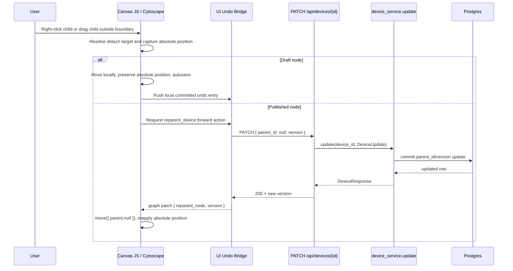
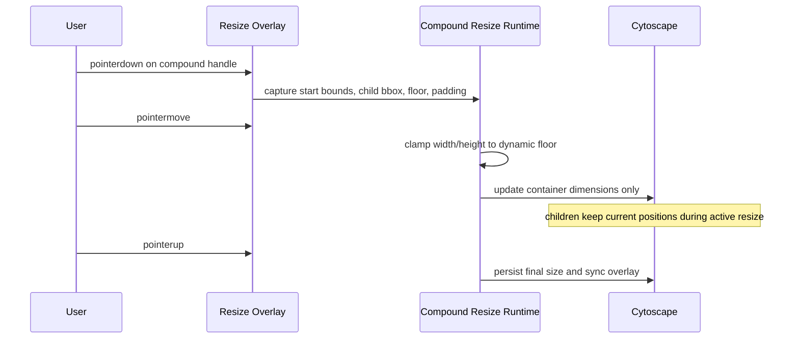

# RFC: HT-077 Container Behavior Overhaul

**Story:** HT-077 · **Status:** Draft · **Date:** 2026-04-19
**Author:** Architect

---

## 1. Overview

HT-077 completes the container interaction model on the topology canvas without widening the backend surface. The current codebase already has published-node drag reparent on `dragfree`, compound resize handles, readonly gating, and a general undo bridge, but the interaction is not acceptance-complete: there is no context-menu un-parent action, drag-out detach is not explicit, compound resize repositions children during active resize, shrink-floor behavior is not the story contract, and converted containers lose their device-type identity.

**Verdict:** Backend-Engineer is **not** required. HT-077 reuses the existing `PATCH /api/devices/{id}` route, the existing `DeviceUpdate.parent_id` contract, and the existing service-layer cycle/version/RBAC protections. All required production changes are in the UI layer and UI-side undo bridge.

Business value: homelabbers can reorganize nested topologies predictably, keep containers visually meaningful, and trust undo/redo for container detach operations without server/API redesign.

---

## 2. Visual Architecture & Flow



Resize flow:



---

## 3. Hidden Design Decisions (Parnas Test)

| Module | Hides |
|---|---|
| `src/ui/components/canvas_container_events.py` | The policy for when a dragged node leaves its current container, when to keep local layout-only movement, and when to request published un-parent via the undo bridge. |
| `src/ui/components/canvas_context_menu.py` | The edit-mode-only action list for node context menus, including when a child may expose `Remove from container`. |
| `src/ui/components/canvas_container_actions.py` | The container-specific forward/undo payload contract, absolute-position preservation logic, and draft-vs-published branching for detach/reparent. |
| `src/ui/components/canvas_js_resize_part_c.py` | The compound-only resize rules: dynamic shrink floor, overflow-driven growth, and the guarantee that children are not repositioned during active resize. |
| `src/ui/components/canvas_styles.py` | The mapping from existing `device_type` node data to container watermark styling and SVG data URIs. |
| `src/ui/components/canvas_undo_action_dispatch.py` | How a published container detach is turned into a single API-backed undoable action without adding new backend endpoints. |
| `src/ui/components/canvas_undo_operation_dispatch.py` | How undo/redo replays `parent_id` transitions and absolute-position restoration against the existing Device PATCH endpoint. |
| `src/ui/components/canvas_undo_js_core.py` | How graph patches mutate Cytoscape locally for parent changes, including top-level detach and nested-container detach without visual jump. |

No backend module is added because the changeable backend decision already lives in:
- `src/api/routers/devices.py`: role-gated device PATCH contract
- `src/services/device_service.py`: version and cycle enforcement for `parent_id`

---

## 4. Data Model Changes

None.

HT-077 does **not** add or change:
- SQLModel fields
- enums in `src/models/types.py`
- repositories
- services
- API routes
- Alembic migrations

Existing schema and API evidence:
- `src/models/device.py` already exposes `DeviceUpdate.parent_id: Optional[uuid.UUID]` and requires `version`
- `src/api/routers/devices.py` already exposes `PATCH /api/devices/{device_id}` with `Role.Contributor`
- `src/services/device_service.py` already validates self-parent, parent existence, cycle prevention, and optimistic locking

**DevOps-Engineer migration review required:** No.

**Backend-Engineer required:** No.

---

## 5. Domain Logic

No new domain function is required.

HT-077 intentionally reuses the existing invariant in `src/domain/devices.py`:
- `detect_parent_cycle(device_id, new_parent_id, parent_map)`

### Contract

- Pre-conditions:
  - For published detach/reparent, the client must send a valid `device_id` and current `version`.
  - If `parent_id` is non-null, it must reference an existing device owned by the same user scope.
- Post-conditions:
  - `parent_id` is either unchanged, set to a new valid parent, or set to `null`.
  - `Device.version` increments on each successful published detach/reparent.
- Invariants:
  - A device still has at most one parent.
  - No containment cycle may be introduced.
  - Detach never deletes the device or its descendants.

---

## 6. Service Layer

No service changes.

### Reused service contract

`src/services/device_service.py:update()` remains the only server-side transaction boundary for published un-parent and nested-container detach.

```python
def update(
    device_id: uuid.UUID,
    data: DeviceUpdate,
    session: Session,
    owner_id: uuid.UUID | None = None,
) -> Device:
```

### Contract

- Pre-conditions:
  - `expected_version == device.version`
  - If `parent_id` is non-null: target parent exists, is not `device_id`, and does not create a cycle
- Post-conditions:
  - `device.parent_id` matches the PATCH body
  - `device.version` increments by 1
  - `session.commit()` completes exactly once on success
- Invariants:
  - No new endpoint, repo function, or domain helper is needed
  - Readonly enforcement is not trusted at the browser layer alone; the route still requires `Role.Contributor`

---

## 7. API Layer (The Contract)

### 7.1 Existing endpoint reused unchanged

**Route:** `PATCH /api/devices/{device_id}`

**Required role:** `Role.Contributor`

**Request JSON for published detach to top level:**

```json
{
  "parent_id": null,
  "version": 7
}
```

**Request JSON for published nested-container detach into another container or re-attach on undo:**

```json
{
  "parent_id": "4e8f6c6f-5d10-4e2b-b2f5-9f88d23d4b18",
  "version": 8
}
```

**Success response shape:**

```json
{
  "id": "3db93d18-8c2f-4f1e-a6e3-9f7d3f0d1221",
  "name": "Server 01",
  "type": "Server",
  "status": "Active",
  "ip": null,
  "mac": null,
  "os": null,
  "notes": null,
  "power_watts": null,
  "location_id": null,
  "parent_id": null,
  "version": 8,
  "created_at": "2026-04-19T10:00:00+00:00",
  "updated_at": "2026-04-19T10:05:00+00:00"
}
```

### 7.2 No new API endpoint

Rejected alternatives:
- `PATCH /api/devices/{id}/parent`: duplicates existing PATCH semantics
- `POST /api/devices/{id}/unparent`: unnecessary surface area
- any container-only route in `src/api/routers/`: violates the existing device update contract without adding new backend safety

### 7.3 Client contract additions on the UI side only

The browser-side undo bridge will add a new **UI action type**, not a new server API:

```json
{
  "type": "reparent_device",
  "payload": {
    "device_id": "3db93d18-8c2f-4f1e-a6e3-9f7d3f0d1221",
    "from_parent_id": "c1-id-or-null",
    "to_parent_id": null,
    "from_rendered_position": { "x": 420.0, "y": 310.0 },
    "to_rendered_position": { "x": 612.0, "y": 344.0 },
    "version_cursor": 7,
    "label": "Remove from container"
  }
}
```

This action type is internal to the canvas undo bridge and resolves through the existing Device PATCH route.

---

## 8. UI Layer

### 8.1 Deterministic interaction blueprint (revised, frontend-only)

This revision supersedes the prior HT-077 interaction blueprint sections. Scope remains UI/canvas only.

1. `Remove from container` appears only when all are true:
   - `window.HT_READONLY !== true`
   - node is not ghost/locked
   - node has non-null `data.parent`
2. Drag-out detach is evaluated only if the drag session started with a non-null parent.
3. Published detach and nested detach use `reparent_device` optimistic action + `reparent_node` graph patch.
4. Draft detach stays local + autosave; no API call.
5. Active compound resize never repositions children.
6. Child-drag container growth is grow-only during active drag.
7. Watermark remains token-driven and non-interactive.

### 8.2 Interruption handling matrix and semantics

Rule of record for all interruption paths:
- if no write has been dispatched yet: cancel interaction and snap back to drag-origin parent/rendered position/selection
- if optimistic write is already in-flight: keep pending state lock; on failure rollback restores parent, rendered position, and selection snapshot atomically

| Interruption signal | Trigger source | When no write dispatched | When optimistic write in-flight |
|---|---|---|---|
| `edit -> view` toggle | `canvas_mode.py` | cancel + snapback | keep pending lock; complete/revert via API result |
| role downgrade/session expiry/readonly flip | auth refresh / readonly guard | cancel + snapback + readonly message | keep pending lock; if 401/403 rollback all snapshots |
| `pointercancel` | browser pointer stream cancel | cancel + snapback | keep pending lock |
| `ESC` | keyboard | cancel + snapback + clear transient hover state | keep pending lock; no extra dispatch |
| `pagehide` | tab close/background | cancel local transient state; autosave draft only if no write pending | preserve pending token and let in-flight settle; rollback on failure callback after resume |

Deterministic state transitions:

$$
idle \xrightarrow{arm\_drag} armed \xrightarrow{distance \ge 5px} dragging \xrightarrow{dispatch} pending \xrightarrow{ok} committed
$$

$$
pending \xrightarrow{error} rollback\_applied \xrightarrow{} idle
$$

### 8.3 Selection-time mutual exclusion (ancestor/descendant)

Deterministic approach selected: auto-prune.

Selection normalization is enforced at selection-time (click, ctrl-click, marquee, and programmatic selection), not only at drag-time.

Algorithm:
1. Build candidate set `S` from user action.
2. Sort candidates by `(depth ASC, id ASC)` where depth is container ancestry depth.
3. Iterate sorted candidates:
   - if candidate has selected ancestor in `R`, skip candidate
   - if candidate is ancestor of nodes already in `R`, remove those descendants from `R`, then add candidate
   - otherwise add candidate
4. Commit `R` as final selection.

This guarantees no final selection contains both ancestor and descendant.

### 8.4 Drag hysteresis

Arm threshold is fixed at `5px` rendered-pointer travel.

- `< 5px`: treated as selection/click gesture, never drag mutation
- `>= 5px`: drag arm activates and drag semantics apply

Distance formula:

$$
d = \sqrt{(x - x_0)^2 + (y - y_0)^2}
$$

### 8.5 Exact deterministic overlap tie-break order

The drop-parent resolver for selected node/container drags must follow this strict order:

1. Candidate set: compounds whose rendered content box contains dragged node center.
2. Remove illegal candidates:
   - self
   - any descendant of dragged node
   - ghost/locked compounds
3. Rank remaining candidates by:
   - greater ancestry depth first (deepest container)
   - smaller rendered area second
   - smaller center-distance third
   - lexical `id` ascending final tiebreak
4. Select first ranked candidate.
5. If no candidate remains:
   - if origin parent exists and center is outside origin bounds + 4px tolerance, detach to top-level (`parent_id = null`)
   - else keep origin parent

This order is mandatory and test-addressable.

### 8.6 Pending optimistic state UX constraints

While `reparent_device` write is pending:
- lock the affected node and current normalized selection against new drag/reparent/resize mutations
- allow viewport pan/zoom and non-mutating inspect actions
- ignore duplicate dispatch attempts for the same node until pending resolves

Concise message policy (single-line toast/banner, max one active message per node):
- blocked drag: `Move blocked: node is busy with another change.`
- pending write: `Saving container move...`
- rollback failure: `Move failed and could not be restored. Reload topology.`

Rollback contract on optimistic failure:
- restore `parent_id`
- restore rendered position
- restore pre-dispatch normalized selection
- clear pending lock

### 8.7 Context-menu and drag-out detach behavior (retained + clarified)

Context-menu detach trigger: `ht:node-remove-from-container` on node with non-null parent.

Published node flow:
1. snapshot `(from_parent_id, from_rendered_position, from_selection)`
2. apply optimistic graph patch to pending state
3. dispatch `reparent_device` via undo action bridge
4. on success, clear lock and commit
5. on failure, rollback snapshot atomically

Draft node flow:
1. snapshot same tuple
2. apply local `reparent_node`
3. push local undo entry
4. autosave draft

Nested detach remains link-only (`C1 -> C2` severed, `C2` descendants unchanged).

### 8.8 Smooth resize + growth + watermark (unchanged core contract)

- compound resize uses dynamic floor from live child bounds
- no child reposition during active pointer drag
- child overflow can only grow parent while dragging
- watermark stays at 15% opacity and behind children

### 8.9 Updated file-by-file diff contract + symbols

#### File: `src/ui/components/canvas_context_menu.py`

Symbols:
- `_build_node_actions`

```diff
 var hasParent = !!(node && node.data && node.data('parent'));
 var actions = [
     { label: 'Start Association', event: 'ht:association-source' },
+    { label: 'Remove from container', event: 'ht:node-remove-from-container', hide: !hasParent },
     { label: 'Duplicate', event: 'ht:node-duplicate', hide: isDraft },
 ];
```

#### File: `src/ui/components/canvas_events.py`

Symbols:
- `_htNormalizeSelectionMutualExclusion`
- `_htSelectionDepth`

```diff
+function _htNormalizeSelectionMutualExclusion(candidates) { ... }  // depth/id deterministic auto-prune
 cy.on('select unselect boxselect', 'node', function() {
+    _htApplyNormalizedSelection(_htNormalizeSelectionMutualExclusion(...));
 });
```

#### File: `src/ui/components/canvas_container_events.py`

Symbols:
- `_htArmDragWithHysteresis`
- `_htOnInteractionInterrupted`
- `_htResolveDropParentDeterministic`

```diff
 cy.on('grab', 'node', function(evt) {
+    _htArmDragWithHysteresis(evt.target, 5);
 });

 cy.on('dragfree', 'node', function(evt) {
     if (window.HT_READONLY) return;
-    var targetParent = _htResolveDetachAwareDropParent(node, origin);
+    var targetParent = _htResolveDropParentDeterministic(node, origin);
     ...
 });

+document.addEventListener('pointercancel', _htOnInteractionInterrupted);
+document.addEventListener('keydown', _htOnInteractionInterruptedEsc);
+window.addEventListener('pagehide', _htOnInteractionInterrupted);
```

#### File: `src/ui/components/canvas_container_actions.py` (new)

Symbols:
- `_htDispatchOptimisticReparent`
- `_htLockPendingInteraction`
- `_htRollbackReparentSnapshot`

```diff
+function _htDispatchOptimisticReparent(snapshot, target) { ... }
+function _htLockPendingInteraction(nodeId, selectionIds) { ... }
+function _htRollbackReparentSnapshot(snapshot) { ... }
```

#### File: `src/ui/components/canvas_mode.py`

Symbols:
- `_htHandleModeFlipInterruption`

```diff
 function setEditMode(enabled) {
     ...
+    if (!enabled) _htHandleModeFlipInterruption();
 }
```

#### File: `src/ui/components/canvas_js_resize_part_b.py`

Symbols:
- `_htResizeApplyCompound`

```diff
- compoundState.childStarts.forEach(function(childStart) { child.position(...); });
+ var floor = _htResizeCompoundLiveFloor(node);
+ calc.width = Math.max(calc.width, floor.width);
+ calc.height = Math.max(calc.height, floor.height);
+ _htResizeApplyCompoundDimensionsOnly(node, calc, compoundState);
```

#### File: `src/ui/components/canvas_js_resize_part_c.py` (new)

Symbols:
- `_htResizeCompoundLiveFloor`
- `_htResizeApplyCompoundDimensionsOnly`
- `_htGrowCompoundForChildOverflow`

```diff
+function _htResizeCompoundLiveFloor(node) { ... }
+function _htResizeApplyCompoundDimensionsOnly(node, calc, compoundState) { ... }
+function _htGrowCompoundForChildOverflow(parent, child) { ... }
```

#### File: `src/ui/components/canvas_styles.py`

Symbols:
- `_build_container_watermark_style`

```diff
+def _build_container_watermark_style(theme_name: str) -> dict[str, object]: ...
+styles.append({"selector": ":parent", "style": {**_compound_style, **_watermark_style}})
+styles.append({"selector": "node.container", "style": {**_compound_style, **_watermark_style}})
```

#### File: `src/ui/components/canvas_undo_action_dispatch.py`

Symbols:
- `dispatch_canvas_action`

```diff
+if action_type == "reparent_device":
+    # optimistic pending lock already applied in UI helpers
+    PATCH /api/devices/{id} with { parent_id: to_parent_id, version }
+    resolve_success(... graph_patch={ op: 'reparent_node', ... })
```

#### File: `src/ui/components/canvas_undo_operation_dispatch.py`

Symbols:
- `dispatch_canvas_operation`

```diff
+if op == "reparent_device":
+    target_parent = from_parent_id if direction == 'undo' else to_parent_id
+    target_pos = from_rendered_position if direction == 'undo' else to_rendered_position
+    PATCH /api/devices/{id}
+    resolve_success(... graph_patch={ op: 'reparent_node', parent_id: target_parent, rendered_position: target_pos, version: next_version })
```

#### File: `src/ui/components/canvas_undo_js_core.py`

Symbols:
- `_reparentNode`

```diff
+function _reparentNode(payload) {
+    var node = window._cy.getElementById(String(payload.node_id));
+    node.move({ parent: payload.parent_id || null });
+    node.renderedPosition(payload.rendered_position);
+    node.data('parent', payload.parent_id || null);
+    node.data('version', Number(payload.version));
+}

 if (op === 'reparent_node') {
     _reparentNode(patch);
     return;
 }
```

---

## 9. Security Boundaries (STRIDE)

### Spoofing
- No new auth surface.
- Published detach still requires JWT-authenticated `Contributor` or `Admin` through existing route protection.

### Tampering
- Browser attempts to force detach in readonly are blocked in the UI and rejected by the route if they bypass the UI.
- `device_service.update()` already protects against stale version writes and containment cycles.

### Repudiation
- No new audit store is added in phase 1.
- Undo entries are client-side interaction state only and do not claim to be a security audit log.

### Information Disclosure
- No new device fields are exposed.
- Watermark generation must use the existing icon mapping only; it must not embed user-provided labels or HTML into SVG.

### Denial of Service
- Child-drag growth checks must be RAF-throttled to one active evaluation per dragged node.
- No polling loop beyond active pointer movement.

### Elevation of Privilege / IDOR
- No new routes.
- Owner scoping continues through the existing device service and route owner resolution.

**Double-gate verification:**
- UI hides `Remove from container` and blocks drag-out in readonly
- API still enforces `Role.Contributor`

---

## 10. Edge Cases

1. **Empty state**
   - A container with zero children still renders as `node.container` and may show a watermark if `device_type` maps to an icon.
   - `Remove from container` never appears for top-level nodes.

2. **Boundary values**
   - Shrink floor clamps at exactly child bbox + `40px` total padding.
   - Boundary comparison uses a 4px rendered tolerance so release on the border does not flap between detach and stay-parented.

3. **Concurrent access**
   - Published detach/reattach uses the existing device version.
   - On conflict, the undo/action dispatcher refreshes the current version before retrying once, matching the existing published reparent pattern. If the server parent already matches the intended target, treat as success and sync version.

4. **Cascade effects**
   - Detaching a nested container severs only its own parent link.
   - Descendants remain attached to the detached container.

5. **RBAC per operation**
   - Reader/view mode: no menu item, no drag-out detach, no forward undo action.
   - Contributor/Admin edit mode: both detach entry points enabled.

6. **Round-trip integrity**
   - Published detach persists only `parent_id`; layout position remains in diagram/draft state as before.
   - Watermark is derived from already-exported `type`, so no new export/import field is introduced.

7. **Canvas impact**
   - Undo/redo must restore `parent` and rendered position together.
   - Active resize must not reposition children.
   - Child drag inside a container may grow the container but may not trigger detach unless the node center leaves the parent bounds on `dragfree`.

8. **Performance at scale**
   - Use direct parent-only bounding box checks for drag-out, not all-compound scans when origin parent exists.
   - Growth checks are RAF-throttled.
   - Resize floor uses direct children only; descendants are already represented in direct-child compound boxes through nested containers.

---

## 11. Files to Create/Modify

| File | Action | Purpose |
|---|---|---|
| `src/ui/components/canvas_context_menu.py` | Modify | Add `Remove from container` action with edit-mode and `hasParent` gating. |
| `src/ui/components/canvas_events.py` | Modify | Enforce selection-time ancestor/descendant mutual exclusion via deterministic auto-prune. |
| `src/ui/components/canvas_container_events.py` | Modify | Add hysteresis arming, interruption hooks, and deterministic overlap parent resolution. |
| `src/ui/components/canvas_container_actions.py` | Create | Isolate absolute-position-preserving detach/reparent helpers and draft/published branching. |
| `src/ui/components/canvas_mode.py` | Modify | On edit->view transitions, trigger interruption cancellation/settlement semantics. |
| `src/ui/components/canvas_js_resize.py` | Modify | Import the new resize fragment and keep resize bundle assembly explicit. |
| `src/ui/components/canvas_js_resize_part_a.py` | Modify | Keep only generic sizing and floor-capture helpers; remove assumptions that children will be repositioned. |
| `src/ui/components/canvas_js_resize_part_b.py` | Modify | Stop repositioning children during active compound resize and delegate to extracted helpers. |
| `src/ui/components/canvas_js_resize_part_c.py` | Create | Hold live floor, dimension-only compound apply, and child-overflow growth helpers. |
| `src/ui/components/canvas_styles.py` | Modify | Add container watermark style generation from existing device icon mapping. |
| `src/ui/components/canvas_undo_action_dispatch.py` | Modify | Add forward `reparent_device` action handling via existing Device PATCH. |
| `src/ui/components/canvas_undo_operation_dispatch.py` | Modify | Add undo/redo replay for `reparent_device`. |
| `src/ui/components/canvas_undo_js_core.py` | Modify | Add `reparent_node` graph patch application, including parent and rendered-position updates. |
| `tests/unit/test_ui_canvas.py` | Modify | Lock menu visibility, readonly gating, undo contract strings, watermark style presence, and resize no-reposition design. |
| `tests/integration/test_device_containers.py` | Modify | Keep API-level detach/nested-detach contract checks unchanged (no backend scope expansion). |
| `tests/e2e/test_topology_canvas_deep.py` | Modify | Add interruption, hysteresis, selection-exclusion, deterministic tie-break, pending-lock, rollback UX coverage. |

No backend production file is modified.

---

## 12. Test Plan

### 12.1 Unit tests

**File:** `tests/unit/test_ui_canvas.py`

Add assertions for:
- `canvas_context_menu.py`
  - contains `Remove from container`
  - includes `hide: !hasParent`
  - still returns early when `window.HT_READONLY`
- `canvas_events.py`
  - contains selection normalization helper for ancestor/descendant exclusion
  - normalization order is depth then id deterministic
- `canvas_container_events.py`
  - hysteresis threshold constant equals `5`
  - handles `ht:node-remove-from-container`
  - contains deterministic drop-parent resolver with strict tie-break chain
  - contains interruption listeners for `pointercancel`, `ESC`, and `pagehide`
  - contains drag-out helper using current parent bounds + 4px tolerance
  - published detach uses `window._htRequestCanvasAction`
  - does not reintroduce direct `fetch('/api/devices/' + nodeId` in event code
  - readonly early return remains
- `canvas_container_actions.py`
  - includes pending lock helper and rollback snapshot restore helper
  - rollback helper restores parent + rendered position + selection snapshot
- `canvas_undo_action_dispatch.py`
  - contains `action_type == "reparent_device"`
- `canvas_undo_operation_dispatch.py`
  - contains `op == "reparent_device"`
- `canvas_undo_js_core.py`
  - contains `reparent_node` graph patch branch
  - updates `node.data('parent', ...)`
- `canvas_styles.py`
  - emitted style JSON for `:parent` and `node.container` includes `background-image`
  - emitted style JSON includes `background-image-opacity` or equivalent 15% watermark configuration
- `canvas_js_resize_part_b.py` / `part_c.py`
  - no active `child.position(` calls remain in compound resize apply path
  - live floor helper exists

### 12.2 Integration tests

**File:** `tests/integration/test_device_containers.py`

Add:

1. `test_patch_parent_id_null_detaches_child`
   - create parent + child
   - `PATCH /api/devices/{child}` with `{"parent_id": null, "version": current_version}`
   - assert `200`
   - assert response `parent_id is null`
   - assert version incremented

2. `test_patch_parent_id_null_requires_contributor`
   - same request as reader returns `403`
   - unauthenticated returns `401`

3. `test_detaching_nested_container_preserves_grandchildren`
   - create `C1`, `C2(parent=C1)`, `leaf(parent=C2)`
   - detach `C2` with `parent_id: null`
   - assert `C2.parent_id is null`
   - GET `leaf?include=ancestors`
   - assert ancestor chain contains `C2` only, not `C1`

No new fixture is required beyond `client`, `contributor_token`, and `reader_token` from `tests/conftest.py`.

### 12.3 E2E tests

**File:** `tests/e2e/test_topology_canvas_deep.py`

Add the following scenarios to the existing deep canvas workflow:

1. **Context-menu detach**
   - create container + published child fixture
   - open context menu on child in edit mode
   - assert menu contains `Remove from container`
   - click action
   - wait for `node.data('parent') === null`
   - assert rendered position delta is within 2px before/after

2. **Drag-out detach**
   - drag child outside parent rendered boundary and release
   - assert `parent` becomes null
   - assert drop position remains within 2px of pointer target

3. **Nested container detach**
   - drag inner container out of outer container
   - assert inner parent null
   - assert grandchild parent still equals inner container ID

4. **Readonly suppression**
   - enter view mode / reader flow
   - right-click child
   - assert `Remove from container` does not appear
   - drag-out does not change `parent`

5. **Resize no-jump**
   - during pointer-driven compound resize, sample child offset before and after pointermove
   - assert no meaningful child-offset jump while the pointer is down
   - assert parent size changes smoothly

6. **Shrink floor**
   - shrink below child bbox + 40
   - assert final compound size equals computed floor within tolerance

7. **Growth on overflow**
   - drag child toward/outside inner boundary without crossing center outside parent
   - assert parent width/height increase
   - assert child remains parented

8. **Watermark rendering**
   - convert a published `Server` device into a container
   - inspect computed Cytoscape style for background image presence and opacity setting

9. **Interruption matrix coverage**
  - for `pointercancel` and `ESC`, assert: no dispatch -> cancel+snapback
  - for `edit->view` and readonly flip during in-flight optimistic request, assert pending lock remains until settlement

10. **Selection-time mutual exclusion**
  - marquee-select ancestor + descendant
  - assert final normalized selection contains only ancestor per deterministic auto-prune

11. **Drag hysteresis**
  - move pointer 4px: assert no drag mutation
  - move pointer 5px: assert drag arm activates

12. **Deterministic overlap tie-break**
  - construct overlapping candidate containers with equal containment
  - assert selected parent follows order: depth > smaller area > center distance > lexical id

13. **Pending lock + messaging**
  - while optimistic write pending, attempt second drag
  - assert blocked behavior and concise message text
  - on forced failure, assert rollback restores parent/rendered position/selection and failure message appears

Coverage target: every acceptance criterion in HT-077 must map to at least one E2E assertion. Unit tests alone are not sufficient because the resize and detach behaviors are visual/interaction contracts.

### 12.4 Acceptance gates (UX sign-off ready)

Frontend acceptance for this revised blueprint is met only when all are green:

1. Deterministic interruption semantics proven for all five signals (`edit->view`, readonly/auth flip, `pointercancel`, `ESC`, `pagehide`).
2. Selection-time ancestor/descendant exclusion proven before drag starts.
3. Hysteresis threshold proven at exact `5px`.
4. Overlap resolver tie-break order proven exactly as specified.
5. Pending optimistic lock and all three concise message policies proven.
6. Rollback failure path proven to restore parent + rendered position + selection snapshot.
7. Existing HT-077 behaviors (detach, resize floor/no-jump, growth, watermark, readonly suppression) remain green.
8. No backend production diff introduced.

---

## 13. Implementation Plan: RFC-HT-077 Container Behavior Overhaul

### 1. Data model
- none — existing `DeviceUpdate.parent_id` and `version` already cover detach/reattach.

### 2. Migration
- none — no schema change.

### 3. Repository
- none — no new repository behavior.

### 4. Domain (pure)
- none — existing cycle detection remains authoritative.

### 5. Service
- none — reuse `device_service.update()` unchanged.

### 6. API routes
- none — reuse `PATCH /api/devices/{device_id}` with `Role.Contributor`.

### 7. UI
- `src/ui/components/canvas_context_menu.py` — add conditional `Remove from container` action.
- `src/ui/components/canvas_events.py` — enforce selection-time mutual exclusion (ancestor/descendant auto-prune).
- `src/ui/components/canvas_container_events.py` — add context-menu detach listener, hysteresis arming, interruption handling, deterministic drag-out/drop-parent resolution, child-overflow growth scheduling.
- `src/ui/components/canvas_container_actions.py` — new shared helper bundle for local/published reparent logic.
- `src/ui/components/canvas_mode.py` — settle interaction interruption semantics on edit/view flips.
- `src/ui/components/canvas_js_resize.py` — import `canvas_js_resize_part_c.py`.
- `src/ui/components/canvas_js_resize_part_a.py` — simplify compound state to bounds/floor inputs only.
- `src/ui/components/canvas_js_resize_part_b.py` — remove child reposition loop and delegate to part C.
- `src/ui/components/canvas_js_resize_part_c.py` — add live floor and overflow-growth helpers.
- `src/ui/components/canvas_styles.py` — add watermark data-URI generation using existing icon mapping.
- `src/ui/components/canvas_undo_action_dispatch.py` — add `reparent_device` forward action.
- `src/ui/components/canvas_undo_operation_dispatch.py` — add `reparent_device` undo/redo replay.
- `src/ui/components/canvas_undo_js_core.py` — add `reparent_node` graph patch applier.

### 8. Tests (Test-Automation-Engineer)
- `tests/unit/test_ui_canvas.py` — contract-level string assertions for menu, selection normalization, hysteresis, interruption hooks, pending lock/rollback semantics, undo, watermark, and resize logic.
- `tests/integration/test_device_containers.py` — PATCH `parent_id: null` happy path + RBAC + nested detach ancestry.
- `tests/e2e/test_topology_canvas_deep.py` — interaction acceptance for detach, interruption matrix, selection exclusion, hysteresis threshold, deterministic overlap tie-break, pending lock messaging, resize floor, growth, watermark, and readonly.

### 9. Docs
- none beyond this RFC for implementation kickoff.

### 10. Verification
- formal CI gate is not run at RFC stage
- implementation must later run:
  - `docker compose exec api pytest`
  - `docker compose exec api mypy src/ --ignore-missing-imports`
  - `docker compose build`
  - `bandit -r src/ -ll -ii`
  - `grep -rn "from src.repositories" src/ui/ --include="*.py"`

### Risks / open questions for Architect
- none — implementation should proceed without additional architectural decisions.

---

## 14. Self-Review Checklist

- [x] Every new function/module described with explicit responsibility
- [x] Every API touchpoint names the required role
- [x] No backend schema or route ambiguity remains
- [x] Modified-file diff intent is explicit
- [x] Files-to-modify table is complete for production and tests
- [x] Edge cases are addressed
- [x] No migration required, and that is stated explicitly
- [x] Parnas table covers every new module
- [x] Test plan references concrete existing fixture files and target coverage