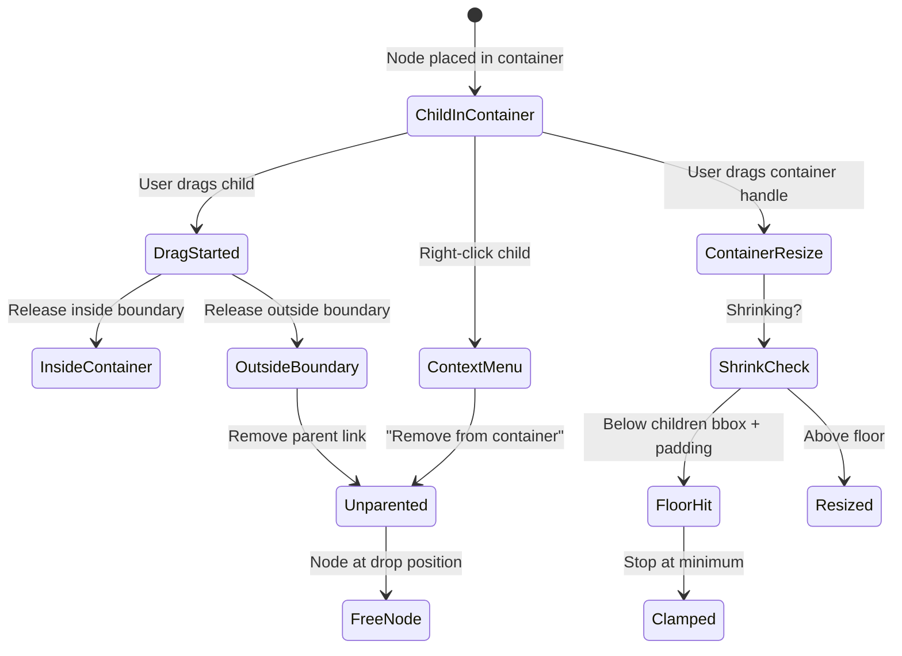

# HT-077: Container Behavior Overhaul — Un-parent, Resize, Icon Watermark

**Status:** Ready
**MoSCoW:** Must
**Kano:** Basic — containers are the primary grouping mechanism; if they're jumpy and items can't be removed, the feature is broken
**Phase:** 1 (Hometower)
**Size:** L

## Job-to-be-Done

As a homelabber organizing my topology, I want containers to behave predictably — smooth resizing, free child movement, the ability to remove children, and a visual identity — so that I can group and rearrange devices without fighting the tool.

## Context

Containers (compound nodes in Cytoscape.js) currently have several usability issues that make them impractical for real topology design:

1. **No un-parent:** Once a node is placed inside a container, there is no way to remove it without deleting the node or unconverting the container. Users need to reorganize freely.
2. **Jumpy resize:** Resizing a container that holds child nodes causes visual snapping/jumping. The resize calculation fights with Cytoscape's compound node auto-layout.
3. **Shrink overreach:** The container can be shrunk smaller than its children's bounding box, causing children to visually overflow or disappear.
4. **No container identity:** When a node is converted to a container, it loses its visual identity. The original device-type icon should remain as a watermark.

Design decisions resolved in session:
- **Un-parent:** Both context menu ("Remove from container") AND drag-outside-boundary.
- **Shrink behavior:** Manual resize with floor — user drags to resize but container stops shrinking at children's bounding box + padding.
- **Container icon:** Centered watermark behind children at 15% opacity.

## Acceptance Criteria

Feature: Container behavior for topology organization

  Scenario: Un-parent via context menu
    Given a node N is a child of container C (N.data.parent === C.id)
    When the user right-clicks node N in edit mode
    Then the context menu includes "Remove from container"
    And clicking "Remove from container" sets N.data.parent to null
    And N is placed at its current absolute position on the canvas (no visual jump)
    And the server is called to persist the parent change
    And undo records the operation (Ctrl+Z restores the parent)

  Scenario: Un-parent via drag-out
    Given a node N is a child of container C
    When the user drags N outside the visual boundary of container C in edit mode
    And releases the mouse
    Then N.data.parent is set to null
    And N stays at the drop position
    And the server is called to persist the parent change
    And undo records the operation

  Scenario: Un-parent a container from a container
    Given container C2 is nested inside container C1
    When the user removes C2 from C1 (via context menu or drag-out)
    Then C2 and all its children move as a group to the new position
    And C2 retains its own children — only the C1→C2 parent link is severed

  Scenario: Smooth container resize with children
    Given container C contains 3 child nodes
    When the user drags a resize handle on C
    Then the container boundary moves smoothly without jumping
    And child nodes do not reposition during the resize operation
    And there is no visible flicker or re-layout during the drag

  Scenario: Container shrink floor
    Given container C contains child nodes whose bounding box is 200×150px
    When the user drags to shrink C smaller than 200×150px plus padding (20px each side)
    Then the container stops shrinking at 240×190px (bbox + 2×20px padding)
    And the resize handle provides visual resistance (cursor stays at grab position but container stops moving)

  Scenario: Free child movement inside container
    Given node N is a child of container C
    When the user drags N within C's boundaries
    Then N moves freely to any position inside C
    And C does not auto-resize or jump during the drag
    And if N is dragged to a position that would exceed C's boundary, the container expands to accommodate

  Scenario: Container watermark icon
    Given device D of type "Server" is converted to a container
    When the container renders on the canvas
    Then the original device-type icon for "Server" appears centered within the container
    And the icon is rendered at 15% opacity (watermark style)
    And the icon is behind (z-index below) all child nodes
    And the icon scales proportionally with the container size

  Scenario: Read-only mode prevents un-parent
    Given the canvas is in view mode (HT_READONLY = true)
    When the user right-clicks a child node
    Then "Remove from container" does not appear in the context menu
    And dragging a child out of a container does not trigger un-parent

## Non-Goals (explicitly out of scope)

- Reparenting a node from one container to another via drag (existing drag-into-container behavior is unchanged)
- Container auto-layout algorithms (children stay where the user places them)
- Nested container depth limits (Cytoscape handles arbitrary nesting)
- Container label editing (handled by existing device detail panel)

## Business Invariants

- A node can have at most one parent container — `device.parent_id` is a single FK, not a many-to-many
- Un-parenting never deletes the child node or the container — it only nullifies the parent relationship
- The server-side `parent_id` update must go through the service layer (not direct repo call) to ensure version increment and undo compatibility
- The shrink floor is computed from the children's current positions, not from any stored "minimum size" — it is dynamic
- Container watermark icon is purely visual (Cytoscape background-image) — it does not affect hit testing or node selection

## UX Interaction Spec

**Drag-out detection algorithm:**
- On `dragfree` event for a child node, compute: is the node's bounding box center outside the parent container's bounding box?
- If yes, trigger un-parent. Place node at its current rendered position (absolute coords).
- If no, keep parent relationship. Container may expand if child exceeds boundary.

**Shrink floor calculation:**
- On resize drag, compute children's aggregate bounding box: `{minX, minY, maxX, maxY}` from all direct children positions + their dimensions.
- Add padding (20px each side).
- Clamp container's new dimensions: `width = Math.max(newWidth, bbox.width + 40)`, `height = Math.max(newHeight, bbox.height + 40)`.

**Watermark rendering:**
- Use Cytoscape's `background-image` node style property with the device type's Material icon SVG.
- Set `background-opacity: 0.15`, `background-fit: contain`, `background-clip: node`.
- The icon URL is resolved from `DEVICE_TYPE_ICONS` mapping → Material Icons font glyph rendered as inline SVG data URI.

**Fitts's Law:**
- "Remove from container" context menu item: full-width row, minimum 32px height, near top of menu (frequent action = closer to click origin)
- Resize handles: minimum 8px hit area (existing from HT-050)

## Notes for Architect / Engineer

- **Un-parent server call:** Use `PATCH /api/devices/{id}` with `{"parent_id": null}`. The existing device update endpoint already supports this. The canvas event handler should call the same service path used by drag-into-container but with `parent_id: null`.
- **Drag-out detection:** Wire into the existing `dragfree` event in `canvas_container_events.py`. After the drag ends, check if the node center is outside `parent.boundingBox()`. If so, call `cy.getElementById(nodeId).move({parent: null})` and fire the API call.
- **Resize jumpiness root cause:** The current resize logic in `canvas_js_resize.py` / `canvas_js_resize_part_b.py` likely conflicts with Cytoscape's compound node auto-fit. During resize, temporarily disable Cytoscape's compound node padding recalculation, apply the manual size, then re-enable.
- **Shrink floor:** Add the bounding box clamp check inside the resize mousemove handler, before applying the new dimensions.
- **Watermark icon:** In `canvas_styles.py`, add a style rule for container nodes that sets `background-image` to a data URI of the device type icon. The icon mapping is in `DEVICE_TYPE_ICONS` in `tokens.py`. Generate SVGs at build time or use inline data URIs.
- **Undo integration:** Both un-parent operations (context menu and drag-out) must push an undo entry via the existing `htPushUndo()` mechanism. The undo action should restore `parent_id` and move the node back to its pre-un-parent position.
