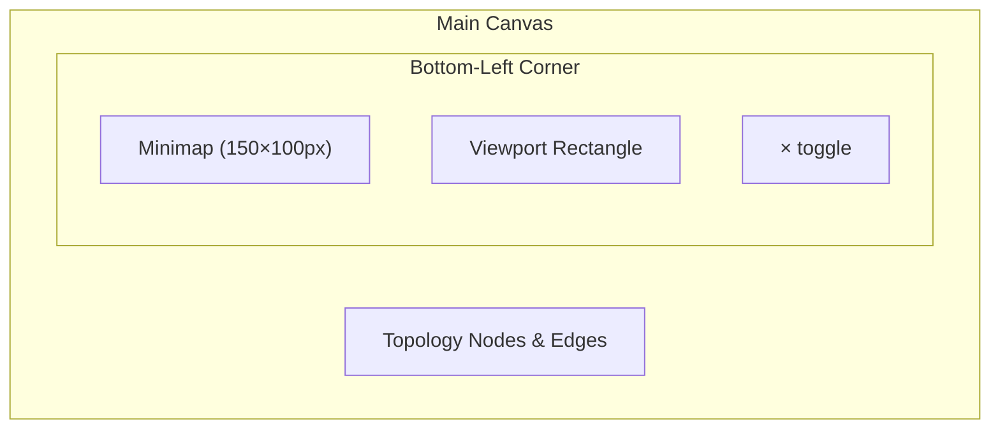

# HT-079: Canvas Minimap Navigation Overview

**Status:** Ready
**MoSCoW:** Should
**Kano:** Performance — improves spatial awareness linearly with topology size; absence is a friction point but not a blocker
**Phase:** 1 (Hometower)
**Size:** M

## Job-to-be-Done

As a homelabber with a large topology (30+ nodes), I want a minimap overview in the corner of the canvas so that I can see where I am in the full topology and navigate quickly to distant areas without losing context.

## Context

As topologies grow beyond a screenful, users lose spatial context when zoomed in. The existing zoom controls (HT-040) help with scale but don't show *where* in the full topology the current viewport is focused. A minimap provides persistent orientation.

Design decision resolved in session: **Bottom-left corner** of the canvas.

## Acceptance Criteria

Feature: Canvas minimap for navigation overview

  Scenario: Minimap renders on topology load
    Given the user navigates to a topology with 10+ nodes
    When the canvas renders
    Then a minimap appears in the bottom-left corner of the canvas
    And the minimap shows a scaled-down view of all nodes and edges
    And the minimap has a semi-transparent background that doesn't obscure the canvas

  Scenario: Viewport indicator on minimap
    Given the minimap is visible
    When the user is zoomed into a portion of the topology
    Then a highlighted rectangle on the minimap shows the currently visible viewport area
    And the rectangle updates in real-time as the user pans or zooms

  Scenario: Click-to-navigate on minimap
    Given the minimap is visible
    When the user clicks a location on the minimap
    Then the main canvas pans to center on that location
    And the zoom level remains unchanged

  Scenario: Drag viewport on minimap
    Given the minimap is visible
    When the user drags the viewport rectangle on the minimap
    Then the main canvas pans in real-time to follow the drag

  Scenario: Minimap respects theme
    Given the user is using the dark theme
    When the minimap renders
    Then it uses theme-appropriate colors (node colors, edge colors, background)
    And switching themes updates the minimap appearance without reload

  Scenario: Small topology hides minimap
    Given the topology has fewer than 5 nodes
    And all nodes fit within the viewport at 1x zoom
    When the canvas renders
    Then the minimap is hidden (not useful when everything is visible)

  Scenario: Minimap doesn't block interaction
    Given the minimap is in the bottom-left corner
    When the user drags a node or draws a connection on the main canvas
    Then interactions work normally — the minimap does not intercept mouse events outside its bounds
    And clicking inside the minimap only triggers minimap navigation, not canvas actions

  Scenario: Minimap toggle
    Given the minimap is visible
    When the user clicks a toggle button on the minimap border
    Then the minimap collapses to a small icon
    And clicking the icon restores the minimap

## Non-Goals (explicitly out of scope)

- Minimap showing device labels (too small to be readable — icons/dots only)
- Minimap editing (no drag, delete, or context menu interactions on minimap nodes)
- Customizable minimap size or position
- Minimap for the geographic map view (Leaflet has its own minimap plugin if needed later)

## Business Invariants

- The minimap is a read-only viewport indicator — it never modifies canvas state
- Minimap rendering must not degrade main canvas performance: max 16ms frame budget. For topologies >100 nodes, use simplified rendering (colored dots instead of shaped nodes)
- The minimap viewport rectangle must always accurately reflect the main canvas's visible area — no drift or desync

## UX Interaction Spec

**Dimensions and positioning:**
- Minimap container: 150×100px, positioned `bottom: 12px; left: 12px` from the canvas container
- Background: `var(--ht-bg-surface)` at 85% opacity with `backdrop-filter: blur(4px)`
- Border: `1px solid var(--ht-border)`, border-radius: `var(--ht-radius-input)`
- Viewport rectangle: `2px solid var(--ht-accent)` with `var(--ht-accent)` fill at 10% opacity

**Fitts's Law justification:**
- Minimap in bottom-left: doesn't conflict with zoom controls (bottom-right) or right panels
- Toggle button: 20×20px in top-right corner of minimap — small but the minimap itself is a contained area so the target is easy to acquire
- Click-to-navigate: the entire minimap surface is the target — maximum target size for the action

**Performance strategy:**
- Render minimap using a second Cytoscape instance (lightweight, no events) OR use Canvas 2D API to draw simplified dots/lines from the main `cy.json()` positions
- Throttle minimap re-render to 100ms intervals during continuous pan/zoom
- For >100 nodes: render circles only (no shapes, no labels)

## Notes for Architect / Engineer

- **Cytoscape approach:** Cytoscape.js does not have a built-in minimap extension that's maintained. The cleanest approach is a `<canvas>` element overlay that reads positions from `cy.nodes()` and `cy.edges()` and draws simplified representations. Listen to `cy.on('viewport pan zoom')` to update.
- **Alternative — cytoscape-navigator:** There's a community extension `cytoscape-navigator` but it's unmaintained (last commit 2020). Avoid it. A custom `<canvas>` renderer gives us full control and matches our theme system.
- **Canvas 2D rendering recipe:**
  1. On each viewport change (throttled): read all node positions and the viewport bounding box from `cy.extent()`
  2. Map node positions to minimap coordinates: `minimapX = (nodeX - extent.x1) / extent.w * minimapWidth`
  3. Draw each node as a colored circle (color from device type)
  4. Draw edges as thin lines between node centers
  5. Draw viewport rectangle: map `cy.extent()` visible area to minimap coords
- **File placement:** New file `src/ui/components/canvas_minimap.py` for the Python injection, with the JS as an IIFE constant. Follow the `canvas_zoom.py` pattern.
- **Z-index:** Minimap overlay z-index should be 5 (above canvas, below resize handles at 8, below tooltips/context menus).
