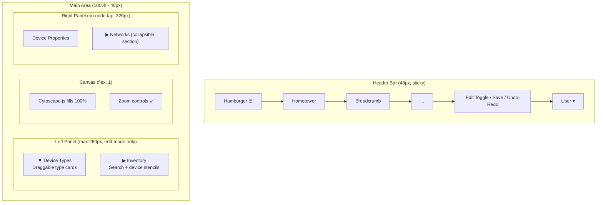

# HT-076: Canvas Full-Screen Layout & Panel Consolidation

**Status:** Ready
**MoSCoW:** Must
**Kano:** Basic — the canvas is the primary design surface; if it can't fill the screen and panels waste space, the product fails its core job
**Phase:** 1 (Hometower)
**Size:** L

## Job-to-be-Done

As a homelabber designing my topology, I want the canvas to fill the available viewport and the side panels to be space-efficient so that I have maximum room to lay out and organize my infrastructure.

## Context

The canvas currently occupies only a portion of the screen. The left side has two separate panels (Device Tools palette + Inventory stencils) that stack horizontally, doubling the width consumed. The right side has a standalone Networks panel separate from the device/container Properties panel. The result is a cramped canvas area that makes topology design feel constrained rather than expansive.

Additionally, the navigation sidebar's collapse behavior is broken — once collapsed, there is no visible affordance to re-expand it.

Design decisions resolved in session:
- **Left panel:** Accordion — Device Types and Inventory stack vertically in one narrow column, each collapsible independently.
- **Right panel:** Networks section integrated directly into the device Properties panel as a collapsible section (no standalone Networks column).
- **Navbar collapse:** Hamburger icon always visible at top-left when sidebar is collapsed.
- **Snap grid:** Deferred — free movement only for now.

## Acceptance Criteria

Feature: Canvas fills available viewport

  Scenario: Canvas occupies full remaining space after header
    Given the user navigates to a topology page
    When the page renders
    Then the canvas fills the remaining viewport area below the header bar (height: calc(100vh - header height), width: 100% minus any open side panels)
    And no empty gutters or unused whitespace exist around the canvas

  Scenario: Left panel uses accordion layout
    Given the user is in edit mode on the topology page
    When the left tool panel is visible
    Then it contains two collapsible accordion sections: "Device Types" and "Inventory"
    And only one section is expanded at a time by default
    And the panel width does not exceed 260px
    And collapsing both sections shrinks the panel to its header-only width

  Scenario: Right panel integrates networks into properties
    Given the user taps a node on the canvas
    When the device Properties panel opens on the right
    Then it includes a "Networks" collapsible section showing the device's network memberships
    And there is no separate standalone Networks column on the right side
    And the network filter toggles (highlight by membership) are accessible within this integrated section

  Scenario: Navbar sidebar re-expand after collapse
    Given the user has collapsed the navigation sidebar
    When the sidebar is hidden
    Then a hamburger menu icon (☰) is visible at the top-left of the header bar at all screen widths
    And clicking the hamburger icon expands the sidebar to its full width
    And the hamburger icon is always visible regardless of viewport width when sidebar is collapsed

  Scenario: Reader role sees no left tool panel
    Given the user has Reader role
    When they view a topology
    Then the left panel (Device Types + Inventory) is not rendered
    And the canvas occupies the full width minus any open right panel

  Scenario: Canvas resizes on panel open/close
    Given the user is on the topology page
    When they open or close the left panel or right Properties panel
    Then the canvas smoothly resizes to fill the remaining space
    And Cytoscape re-renders without visual glitches (calls `cy.resize()`)

## Non-Goals (explicitly out of scope)

- Snap-to-grid system (deferred per design session — free movement only)
- Redesigning the header bar itself
- Changing the topology page route structure
- Mobile-specific responsive layout beyond existing breakpoints
- Minimap (separate story HT-079)

## Business Invariants

- The canvas container must always have `position: relative` and fill its parent flex item — it must never have a fixed pixel height
- Accordion state (which section is expanded) does not persist across page navigations — it resets to "Device Types expanded" on each visit
- The hamburger icon must be rendered in the header DOM regardless of sidebar state — it is not dynamically injected/removed
- RBAC: Readers never see the left tool panel; Contributors and Admins see both accordion sections

## UX Interaction Spec

**State transitions:**
- Default: Left panel hidden (view mode). Canvas fills 100%.
- Edit mode entered → Left panel slides in (260px). Canvas shrinks. `cy.resize()` fires after transition.
- Node tapped → Right Properties panel slides in (320px). Canvas shrinks. `cy.resize()` fires.
- Sidebar collapsed → Hamburger visible. Canvas gains ~220px width. `cy.resize()` fires.

**Fitts's Law justification:**
- Hamburger icon: 36×36px touch target, always at top-left (corner targeting = infinite edge, fast acquisition)
- Accordion headers: full-width click targets (spans entire panel width), minimum 36px height
- Panel collapse: single click, no nested menus

**Edge-case constraints:**
- Minimum canvas width: 400px — panels should not render if viewport < 660px (400 + 260 left)
- If viewport is too narrow for both panels + canvas, right panel overlays canvas (position: absolute) rather than squeezing canvas below minimum

## Notes for Architect / Engineer

- The current topology page layout uses `ui.row()` with `flex: 1` for the canvas. The issue is likely that the parent containers don't have `min-height: 0` or the outer column doesn't stretch to fill the viewport. Audit the flex chain from `app_shell` → page content → `ui.row()` → canvas div.
- `render_palette()` and `render_stencils_panel()` are currently side-by-side inside a single `palette_container` div. They need to be restructured into a single-column accordion.
- `render_network_filter_panel()` currently renders as a standalone 220px column. This needs to be removed as a top-level element and its network toggle UI moved into `render_detail_panel()` as a collapsible section.
- The sidebar's `show-if-above` breakpoint prop hides the sidebar at narrow widths but the hamburger toggle (`ht-mobile-drawer-open` class) is only visible below 768px. The fix: remove the media query restriction so the hamburger is always visible when sidebar is collapsed, regardless of width.
- Call `cy.resize()` after any panel transition completes — use a `transitionend` listener or a debounced timeout.
- The network highlight state (active network IDs) must be preserved when the Properties panel opens/closes. Store it in `window._htActiveNetworkIds`.